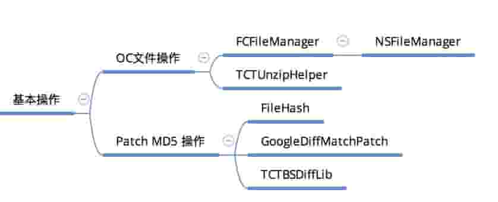

[[toc]]

[TOC]

# 源码学习与重构

### 大纲

#### 分析

* 输入 输出分析，即这个库解决了什么问题，怎么解决的。用到的基础知识有那些；如果自己实现，大致的思路是什么
* 代码流程分析，类的结构图、流程图分析梳理，通过代码逻辑结构和断点调试，自己绘制出流程调用图，用Xmind或其他工具表示，期间可以使用 MD 流程图、doxygen+graphviz 分析当前库
* 分拆出库的各个基本功能单元，把这些基本功能单元要完成的功能逐个分析清楚，即通过前面分析整个功能得到基本功能单元，然后把基本功能单元分析清楚，再分析整个功能

#### 重构

* 把用到的知识点先学习清楚，比如网络基础知识，多线程知识等等
* 重构代码要先分析，根据原始需求和前面分析的基本功能单元，思考抽象后得出抽象的结构设计图，依据单一职责分析出各个类，包含类名，基本属性和功能，
* 抽象编码，这一步根据结构设计图，设计出各个类及其属性方法，这一步不需要把方法具体实现，只需要根据设计出的类结构，把核心功能设计出来
* 具体编码，把抽象的方法都具体实现出来

#### 遇到的问题

* 期间自己写着写着，经常会感觉思维间断，就是那种不知道怎么写的一种感觉。现在觉得应该是自己思维的不足，要经过大量锻炼训练这块，加快思维速度

### 具体案例

#### 重构 TCTReactNative

#### 分析

* 库作用：这个库是RN的更新库，主要更新Bundle包，包含了更新Common包和Project包

* 基础知识点，先把这些基础知识点搞清楚，基本原理和使用搞明白

  

* 源码流程分析，先分析库原始逻辑，通过单步调试的方式梳理出现有流程逻辑，然后绘制Xmind或流程图，整理出原始逻辑。

* 库代码重构，分析出原始逻辑需求后，通过详细分析规划，再重构代码。重构的核心是尽量不要在原始代码逻辑上修改，梳理出原始逻辑需求后，重新分析重构

参考资料：

[Draw Diagrams With Markdown](http://support.typora.io/Draw-Diagrams-With-Markdown/)

[如何优雅的分析代码](http://guqian110.github.io/pages/2015/01/11/how_to_analyse_code_elegantly.html)

[用doxygen+graphviz生成函数调用流程图](https://www.jianshu.com/p/fe4b6b95dca5)

