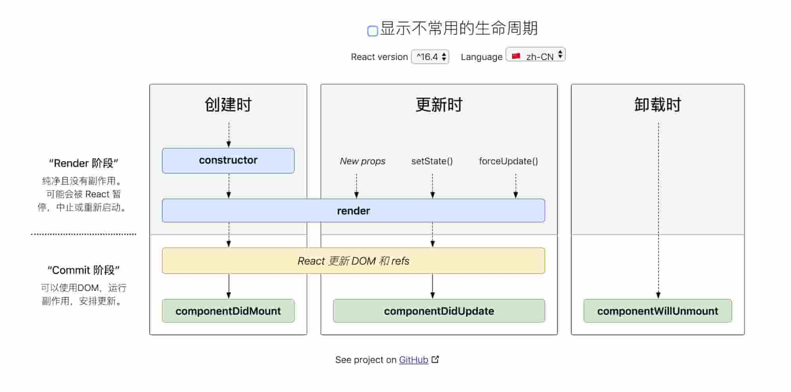
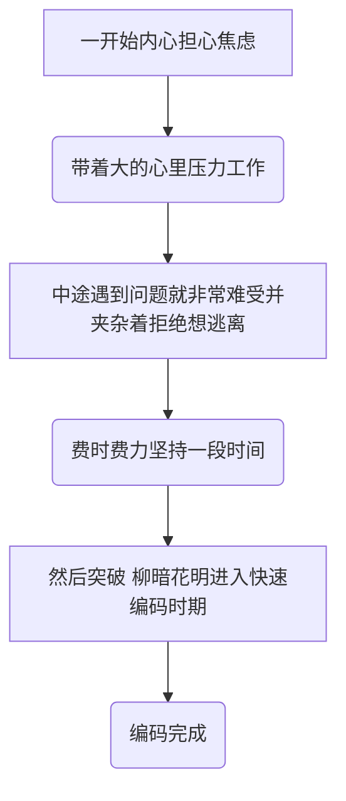
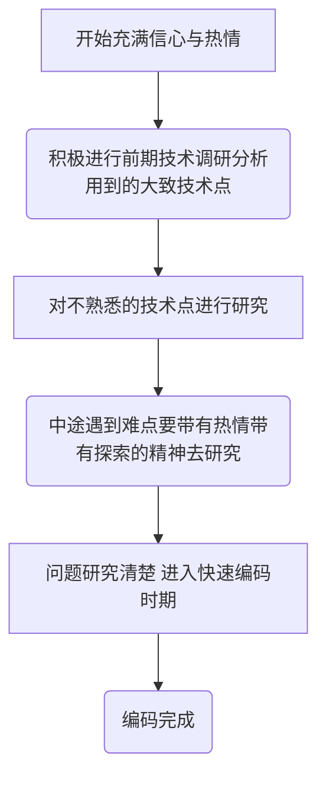

[[toc]]
# 构建系统开发纪要

## css文件里必须加载Antd的css,否则整个页面会失掉格式

```css
@import '~antd/dist/antd.css';
```


## 展开运算符`...`

```jsx

//如果你已经有了一个 props 对象，你可以使用展开运算符 ... 来在 JSX 中传递整个 props 对象。以下两个组件是等价的：
function App1() {
  return <Greeting firstName="Ben" lastName="Hector" />;
}

function App2() {
  const props = {firstName: 'Ben', lastName: 'Hector'};
  return <Greeting {...props} />;
}
```

详见 [深入JSX](https://react.docschina.org/docs/jsx-in-depth.html)


## JSX 中的子元素

包含在开始和结束标签之间的 JSX 表达式内容将作为特定属性 `props.children` 传递给外层组件

```jsx
// props.children = Hello world!
<MyComponent>Hello world!</MyComponent>
```


## 组件生命周期




## React.Fragment

`React.Fragment` 组件能够在不额外创建 DOM 元素的情况下，让 `render()` 方法中返回多个元素。

简写方法 `<></>`。

```jsx
render() {
  return (
    <React.Fragment>
      Some text.
      <h2>A heading</h2>
    </React.Fragment>
  );
}
```


## 添加 React Router

```shell
yarn add react-router-dom
```


## exprot & import

详见 [ECMAScript 6 入门 - Module 的语法](http://es6.ruanyifeng.com/?search=import&x=0&y=0#docs/module)


## 打开新页面 `window.open()`

```js
window.open("http://www.github.com");
```


## 关于文本对齐

需要让p文本对齐，但是不知道怎么对齐，后来跟同事沟通，才想起来是使用css，哈哈哈...


## 关于 AntD中栅格的 xs sm md log xl xxl

[Gird 栅格](https://ant.design/components/grid-cn/)

参照 Bootstrap 的 [响应式设计](http://getbootstrap.com/css/#grid-media-queries)，预设六个响应尺寸：`xs` `sm` `md` `lg` `xl`  `xxl`。（[Bootstrap中文](https://v3.bootcss.com/css/#grid-options)）

具体说明：

* xs 	`<576px` 响应式栅格，可为栅格数或一个包含其他属性的对象
* sm  `≥576px` 响应式栅格，可为栅格数或一个包含其他属性的对象
* md  `≥768px` 响应式栅格，可为栅格数或一个包含其他属性的对象
* lg  `≥992px` 响应式栅格，可为栅格数或一个包含其他属性的对象
* xl  `≥1200px` 响应式栅格，可为栅格数或一个包含其他属性的对象
* xxl  `≥1600px` 响应式栅格，可为栅格数或一个包含其他属性的对象


## 关VSCode Setting

所有的插件配置都在 `Prefenrencs --> Setting --> Extensions` 里，打开Setting界面可以直接输入对应的插件名进行寻找。


## 解决高度问题
开始左侧sider和中间一直不能拉伸到整个屏幕，非常丑，一直解决不了
问题原来是浏览器对高度的处理跟宽度不一样，就是设置height:100%是不起作用的，浏览器不会计算高度，只会简单的把内容往下布局，具体见 [如何让 height:100%; 起作用](http://www.webhek.com/post/css-100-percent-height.html) 

理解了原理，然后工程中设置对应元素的100%就可以了

```html
//设置最外层的Layout
<Layout style={{height: '100%'}}>

//设置index.html中的div
<div id="root" style="height: 100%;"></div>
```


## forEach 函数不能中止或提前跳出，如果需要查找某个元素，一般用find函数

详见 <https://developer.mozilla.org/zh-CN/docs/Web/JavaScript/Reference/Global_Objects/Array/forEach>


## Antd 表单

在Antd的表单中，如果 按钮实现了onClick事件，表单就不再接管按钮的提交事件，就不会响应 handleSubmit ，但是如果不实现 onClick 事件，表单就会接管，响应handleSubmit事件


## 开发小结

整个开发过程，由开始的一脸茫然内心各种无措，到中间渐渐有点眉目，到最后了然于胸。通过这个项目，算是第一次实战了Web开发，熟悉了React框架、Antd框架，了解到了很多周边框架，基本算是前端入了个门，有那么一点了解，有那么一点小信心了。

通过这个项目用到的知识点：

* React框架
* Antd框架
* 网页的Flex布局
* HTML/CSS 以前总结的xmind


现在重新看一遍这个项目，其实还是很简单的，都是一些很简单的元素，直接用Antd框架堆元素就可以了。重点是自己必须通过这个项目好好反思下自己的内心状态变化，

现在我做一个新项目的内心状态：




我期望的一个新项目的内心状态：



其中核心就是：

* 对新技术要有热情
* 遇到难点要带着热情去探索（其实也没什么难的）


## 下一步

* JS继续研究，犀牛书仔细研究一遍
* HTML/CSS继续熟悉
* React继续学习，熟悉后面语法
* React.js小书学习
* 熟悉 React Router ，控制页面堆栈
* 熟悉 Redux，管理数据流动
* 项目继续用Antd，熟悉该框架


## 资料附录

* [React 中文文档](https://react.docschina.org/)
* [React.js 小书](http://huziketang.mangojuice.top/books/react/)
* [Create React App 中文文档](https://www.html.cn/create-react-app/)
* [React Router 英文站点](https://reacttraining.com/react-router/)
* [React Router 中文站点](https://react-router.docschina.org/)
* [Redux 中文文档](https://cn.redux.js.org/)
* [MDN web docs](https://developer.mozilla.org/zh-CN/) 查HTML/CSS/JS各种定义API等
* [W3C中国](http://www.chinaw3c.org/)
* [Bootstrap](https://v3.bootcss.com/)
* [印记中文](https://www.docschina.org/)
* [印记中文周刊](https://weekly.docschina.org/)
* [Ant Design 实战教程（beta 版）](https://www.yuque.com/ant-design/course)
* [Flex 布局教程：语法篇](http://www.ruanyifeng.com/blog/2015/07/flex-grammar.html)

* [ECMAScript 6 入门](http://es6.ruanyifeng.com/#README)