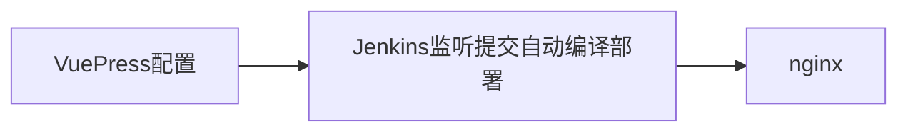
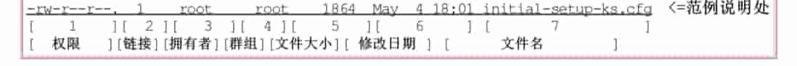
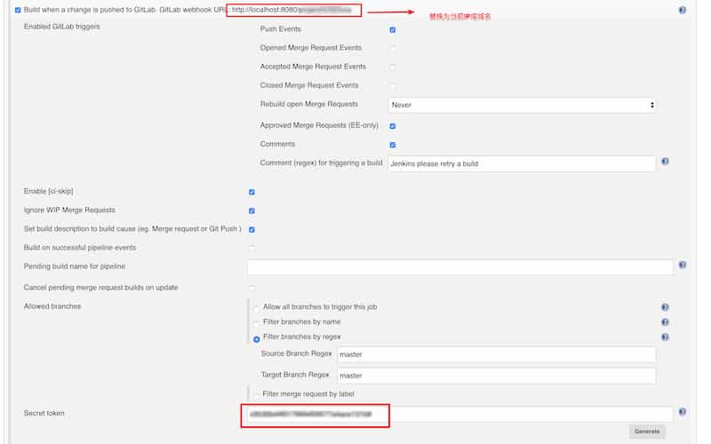

[[toc]]
[TOC]

# 从零搭建VuePress站点

用到技术点：

* Yarn
* Nginx
* Jenkins
* VuePress


流程为



即通过Git管理文档（VuePress项目docs文件夹内），Jenkins自动监听提交，然后通过VuePress编译输出成站点，自动部署到Nginx指定的root目录，用户即可通过Nginx配置的指定域名或IP访问站点。


## Yarn


### 站点

有两个中文站点，官方的和bootcss，bootcss基本与官方站点同步，不过目前官方站点本身已经支持了中文，所以直接看官方中文站点即可

* [官方站点](https://yarnpkg.com)

* [bootcss维护的中文站点](https://yarn.bootcss.com/) ，


### 介绍

Yarn是一个类似npm的包管理器，是Google facebook 等公司联合推出的。但是注册表还是用的npm的，即代码源还是npm的。相比较npm来说，大致有以下优点：

* 有类似 .lock文件，能够明确包版本
* 平行安装，下载比较快
* Log输出简介


### 常用命令

#### 初始化一个新项目

```shell
yarn init
```

#### 添加依赖包

```shell
yarn add [package]
yarn add [package]@[version]
yarn add [package]@[tag]
```

#### 将依赖项添加到不同依赖项类别中，分别添加到 devDependencies、peerDependencies 和 optionalDependencies 类别中：

```shell
yarn add [package] --dev
yarn add [package] --peer
yarn add [package] --optional
```

#### 升级依赖包

```shell
yarn upgrade [package]
yarn upgrade [package]@[version]
yarn upgrade [package]@[tag]
```

#### 移除依赖包

```shell
yarn remove [package]
```

#### 安装项目的全部依赖

```shell
yarn

或者

yarn install
```


## Nginx

Nginx是一款轻量级的Web 服务器/反向代理服务器及电子邮件（IMAP/POP3）代理服务器。通过Nginx，用户最后可以访问到我们的VuePress站点内容。


### 站点

[官方站点](http://nginx.org/)

[深入浅出Nginx](https://www.jianshu.com/p/5eab0f83e3b4)


### 常用命令

#### 安装

mac上安装通过Homebreww，请先安装Homebrew

```shell
brew install nginx
```

#### 卸载

```she
brew uninstall nginx
```

#### 启动nginx

```shell
nginx
或
service nginx start
```

#### 停止nginx

```shell
nginx -s stop
```

#### 查看nginx进程

```shell
ps -ef | grep nginx
```

#### 平滑启动nginx

平滑启动的意思是在不停止nginx的情况下，重启nginx，重新加载配置文件，启动新的工作线程，完美停止旧的工作线程

```shell
nginx -s reload
```

#### 强制停止nginx

强制停止所有nginx进程

```shell
pkill -9 nginx
```

#### 检查对nginx.conf文件的修改是否正确

也可使用该指令，查看config文件位置

```shell
nginx -t
```

#### 查看nginx的版本

```shell
nginx -v
```


### 配置

两个比较常用的目录：

* Nginx默认的站点目录为：`/usr/local/var/www`，

* 配置文件位置：`/usr/local/etc/nginx/nginx.conf`

对于Nginx的基本使用来说，配置很简单，常用配置节点：

- worker_processes 允许进程数，配置等于当前CPU核数 
- http.server.listen 监听的IP 端口，可以只指定IP或端口，也可以一起指定，`listen 8110`
- http.server.server_name 监听的域名，多个域名用空格隔开，`server_name  www.test.cn`
- http.server.access_log，指定访问日志存储路径，access_log    `/Users/water/Desktop/TCTDestination/access.log`
- http.server.location.root，指定http服务器根目录，root   `/Users/water/Desktop/VuePress/docs/.vuepress/dist`
- http.server.location.index，指定首页，`index  index.html index.htm`

注意，如果监听多个IP可以写多个 server

Server节点配置示例：

```nginx
server {
        listen       800;
        server_name  www.test.cn;

        #charset koi8-r;

        access_log  logs/host.access.log  main;
		

        location / {
            root   /Users/VuePress/docs/.vuepress/dist;
            index  index.html index.htm;
        }

        #error_page  404              /404.html;

        # redirect server error pages to the static page /50x.html
        error_page   500 502 503 504  /50x.html;
        location = /50x.html {
            root   html;
        }
    }
	
	server {
    	#指定鉴定的地址端口号
		listen 10.101.56.4:8080;
		# 站点访问日志log，有需要就打开，指定到项目存放的log文件目录上
        access_log  logs/host.access.log  main;
		

        location / {
        	#指定站点根目录
            root   /Users/VuePress/docs/.vuepress/dist;
            index  index.html index.htm;
        }

        #error_page  404              /404.html;

        # redirect server error pages to the static page /50x.html
        error_page   500 502 503 504  /50x.html;
        location = /50x.html {
            root   html;
        }
		
	}
```


### 遇到的问题

#### still could not bind() 问题

当启动nginx 有以下提示：

```shell
nginx: [emerg] bind() to 0.0.0.0:80 failed (48: Address already in use)
nginx: [emerg] bind() to 0.0.0.0:80 failed (48: Address already in use)
nginx: [emerg] bind() to 0.0.0.0:80 failed (48: Address already in use)
nginx: [emerg] bind() to 0.0.0.0:80 failed (48: Address already in use)
nginx: [emerg] bind() to 0.0.0.0:80 failed (48: Address already in use)
nginx: [emerg] still could not bind()
```

说明 80 端口被占用，查看某端口被占用情况时，使用以下查找是那个服务占用的：

```shell
netstat -an | grep 80

或
lsof -i:80
-i参数表示网络链接，:80指明端口号，该命令会同时列出PID，方便kill
```

不过最后也没查到是那个服务，修改了监听的端口号

#### 绑定虚拟IP

经过测试，nginx不能绑定不存在的ip，比如任意指定的ip，必须要有网卡支持。如果需要支持，则可以通过给IP绑定别名解决，具体有需要的时候研究下。

```shell
//绑定任意IP 会出以下问题
nginx: [emerg] bind() to 127.0.0.3:8110 failed (49: Can't assign requested address)
```


### 其他点

#### grep 命令

grep 命令是一个比较好用的命令，后面可以常用起来，比如

```shell
Ls -l | grep hosts     //匹配hosts 文件
Ls -lh                 //显示文件大小时会带上单位，比如B M  G 等
```

#### Linux文件基本权限

关于文件权限，哎，十几年前看的鸟哥的私房菜，当时只看了一点便收益到现在，可惜没一直专注下去，后面要继续看完

终端通过 ls -l 命令查看一个文件，会看到显示如下：



* Linux文件的基本权限就有九个，分别是owner/group/others三种身份各有自己的read/write/execute权限

* -rw-r--r--@最后面还有个@，这个其实是mac系统的文件自带的一个表示文件有扩展属性的标示，与权限无关


常用命令

```shell
//修改文件所在群组
chgrp [-R] 属组名 文件名

//修改拥有者
chown [–R] 属主名 文件名
chown [-R] 属主名：属组名 文件名

//修改权限
chmod [-R] xyz 文件或目录
chmod u=rwx,g=rx,o=r 文件名

```

#### 修改 hosts

配置Nginx的过程中，会经常修改hosts文件进行测试。

现在Mac 的机制是不能直接修改 /etc/hosts 文件，每次更改都会复制一个新文件，然后我在桌面生成，拥有者和群组就会是用户的，比如

```shell
-rw-r--r--@  1 water  staff     330 May 10 13:52 hosts 
```

但是 /etc/host 要求是：

```shell
-rw-r--r--@  1 root  wheel     421 May 10 16:37 hosts
```

如果直接替换，会不生效，需要修改拥有者和群组。


这样修改比较麻烦，有一个工具很方便 [ihosts](https://h.ihosts.toolinbox.net/cn/)。


## Jenkins

Jenkins是一个很强大的持续集成和持续交付工具，这里我们用于VuePress代码提交后，通过Jenkins Hook 仓库的提交，然后对代码进行编译和部署。

### 站点

Jenkins网站本身就支持中文，很方便。[Jenkins](https://jenkins.io/zh/)


### 安装

通过官网下载Mac pkg进行安装。

安装包后，在电脑上 localhost:8080  打开失败，需要先启动Jenkins

```shell
java -jar jenkins.war --httpPort=8080
```


### 配置

1. 安装插件。在Jenkins->系统管理->插件管理，中安装gitlab 插件。
2. 然后回到项目配置里，会多一条下面的：Build when a change is pushed to GitLab. GitLab webhook URL: xxxx
   
3. 然后去Gitlab页面Integrations里配置 webhook 上面的URL 和 token
4. 然后添加要执行的动作，就完成了，整体上比较简单


## VuePress

VuePress是一个很强大的静态网站生成器，指南和配置官网说明的很清楚，按照官网的配置指南进行操作即可。值得一说的是1.x版本开始支持插件了，后面可以预想会更加强大。

### 站点

[VuePress](https://vuepress.vuejs.org/zh/)


### 静态资源

官方文档里，对静态资源有描述，[需要注意下](https://vuepress.vuejs.org/zh/guide/assets.html#%E7%9B%B8%E5%AF%B9%E8%B7%AF%E5%BE%84 )。

简单来说，就是非 相对路径、公共路径、基础路径 

- 相对路径，推荐markdown的文件里采用相对路径来写 
- 公共路径，如果需要全局资源，不直接被某个markdown文件引用的文件，可以放到 `.vuepress/public` 
- 基础路径，如果站点部署的不是非根目录，必须设置 base。 比如 放到站点的/bar/下，则 base 为 /bar/ 

其他注意点：

* Markdown 文件里的图片资源，如果 写的路径是 `img/diagram.png`，则图片处理会失败，必须写成 `./img/diagram.png` 的形式。 
* 文档里附带的xmind等其他需要可供下载的，需要放到`.vuepress/public` 目录下


### 侧边栏配置

* 通过配置侧边栏，发现文件夹名字不能是中文，中文配置会有问题
* 如果没有 README.md 文件，点击导航栏后对应的导航栏项目会没有选中的蓝线


## Node.js

Node这里也提一下，Node的安装有三种形式： 

- n命令 
- nvm，是Mac下专门管理node的管理工具
- homebrew，如果是使用Homebrew升级的node，则需要使用homebrew来升级

推荐的安装顺序：

- 通过homebrew 安装nvm,`brew install nvm` 
- 通过nvm 安装Node, `nvm install node`

关于n命令：

> node 版本管理工具还有一个是 TJ大神的 [n](https://github.com/tj/n) 命令，n 命令是作为一个 node 的模块而存在，而 nvm 是一个独立于 node/npm 的外部 shell 脚本，因此 n 命令相比 nvm 更加局限。
>
> 由于 npm 安装的模块路径均为 /usr/local/lib/node_modules，当使用 n 切换不同的 node 版本时，实际上会共用全局的 node/npm 目录。 因此不能很好的满足『按不同 node 版本使用不同全局 node 模块』的需求。


相关命令：

```shell
//查看node版本
node -v

//查看node安装位置
which node
```

