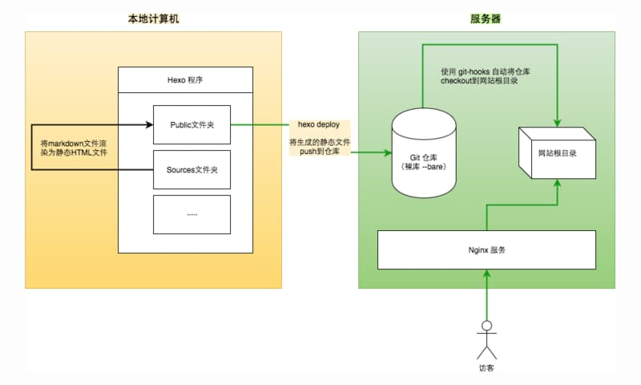

[[toc]]
[TOC]

最近在服务器上搭建了一个博客，用于存放主题资料。博客框架使用了Hexo，Web服务器使用了Nginx。

以前把Hexo搭建到Github上，这次本来想直接搭建到公司的Gitlab上，但是发现公司的Gitlab把Page功能禁用了，只能搭建到我们小组的服务器上。整体框架如下：



注：图片来自《[如何在服务器上搭建hexo博客](https://segmentfault.com/a/1190000009363890)》


简单来说，就是首先服务器部署Nginx，本地使用Hexo生成博客，然后推送到服务器的Git仓库，再使用git hook功能，当博客被推送到Git仓库后自动部署到Nginx的指定目录里，完成文章发布。


#### 相关技术点

* Git, SSH
* Hexo
* Nginx


#### 环境介绍

本地与服务器都为Mac OS 系统


#### 搭建流程

1. 本地安装 Hexo 
2. 本地生成ssh公钥私钥，并把公钥复制到服务器
3. 服务器安装Nginx，初始化Git仓库
4. 本地使用Hexo生成博客，然后部署到服务器


#### 本地环境搭建

* 本地安装 Hexo ，具体流程参见官方文档 [Hexo](https://hexo.io/zh-cn/docs/) ，安装成功后，再安装两个插件 hexo-deployer-git 和 hexo-server 

  ```shell
  npm install hexo-deployer-git --save
  npm install hero-server --save
  ```

  

* 生成ssh，具体参见 [Github SSH](https://help.github.com/articles/connecting-to-github-with-ssh/) ，这里有一点要注意，基本上本地都已经有ssh文件了，在生成的过程中，注意给本次生成的ssh改个名字，然后打开 `~/.ssh/config`文件（如果没有就新增一个），在config新增一个 Host ，具体参见 [Adding your SSH key to the ssh-agent](https://help.github.com/articles/generating-a-new-ssh-key-and-adding-it-to-the-ssh-agent/#adding-your-ssh-key-to-the-ssh-agent) 。

* 将生成的`.pub`公钥文件拷贝到`~/.ssh/`目录下，并重命名为**authorized_keys**，如果已经存在**authorized_keys**，那么就新建一行将公钥文件的内容拷贝进去。修改**authorized_keys**权限为600（很重要，如果权限不安全，则无法使用该功能）


#### 服务器环境搭建

* 在服务器上使用`Homebrew`安装Nginx （如果没有[Homebrew](https://brew.sh/)，请先安装），安装后，注意修改 `nginx.conf`文件，打开一个server 修改为：

  ```
      server {
          listen       80;
          server_name  10.100.10.10;

          location / {
              root   html;
              index  index.html index.htm;
          }
      }
  ```

  然后启动 Nginx服务

  ```
  sudo nginx
  ```

  

* 新建git仓库，用以下命令初始化Git仓库

  ```shell
  sudo git init --bare blog.git
  ```

  配置 git hook，在 blog.git/hooks 目录下新建一个 post-receive 文件,然后输入以下内容

  ```
  git --work-tree=/home/www/hexo --git-dir=/var/repo/blog.git checkout -f
  ```

  注意，`/home/www/hexo` 要换成你自己Nginx 部署目录，`/var/repo/blog.git` 要替换成你自己的Git

  修改文件的可执行权限

  ```
  chmod +x post-receive
  ```


#### 回到本地环境

修改hexo目录下的 _config.yml 文件

```Ruby
deploy:
type: git
repo: 服务器登录的用户名@服务器git仓库地址
branch: master
```

其中 repo 地址比如为 `admin@10.10.10.10::/var/repo/blog.git`


开始写博客发布

```shell
$ hexo new "Hello world"	//新建文件
$ hexo g					//生成博客
$ hexo d					//部署
```


其中我遇到的一些坑，主要是权限问题，如果遇到部署不成功，注意排查是否是权限问题导致的。


**附录：参考文章**

[如何在服务器上搭建hexo博客](https://segmentfault.com/a/1190000009363890)

[Github SSH](https://help.github.com/articles/connecting-to-github-with-ssh/)

[Hexo](https://hexo.io/zh-cn/docs/)

[Nginx](http://nginx.org/)

[极客学院 Nginx入门指南](http://wiki.jikexueyuan.com/project/nginx/)

[Nginx配置文件nginx.conf中文详解](http://www.ha97.com/5194.html)