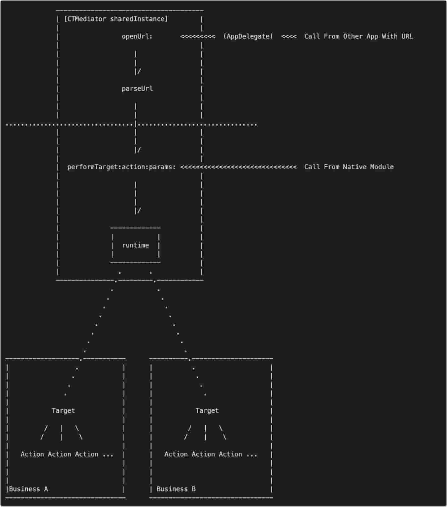

[[toc]]

[TOC]

# iOS组件化开源库阅读

## CTMediator

该库核心就是 `performSelector:withObject:` 方法，使其动态调用。外部通过调用 CTMediator ，传入 target, action,然后 动态调用对应的方法，达到目的。

示例代码

```objective-c
UIViewController *viewController = [[CTMediator sharedInstance] CTMediator_viewControllerForDetail];
```

架构图




参考文章：

[iOS应用架构谈 组件化方案](https://casatwy.com/iOS-Modulization.html)

[CTMediator](https://github.com/casatwy/CTMediator)


## MGJRouter

是蘑菇街开源的一个Router方案，该方案采用注册 url的方式，处理模块间的调用。

代码示例

```objective-c
//代码注册
[MGJRouter registerURLPattern:@"mgj://foo/bar" toHandler:^(NSDictionary *routerParameters) {
    NSLog(@"routerParameterUserInfo:%@", routerParameters[MGJRouterParameterUserInfo]);
}];

//代码调用
[MGJRouter openURL:@"mgj://foo/bar"];

```


基本思路

* 注册后存储一个这样的字典

  ```objective-c
  //url : water://index/index
  
  {
      water =     {
          index =         {
              index =             {
                  "_" = "<__NSGlobalBlock__: 0x1052b83a0>";
              };
          };
      };
  }
  ```

* 然后 openURL: 的时候，去循环遍历找到 最终的 “_" 的处理handle


小结

* 这里的url 被广泛处理页面调用，模块调用，而不是单纯的处理 页面跳转
* 开机需要注册一个庞大的字典，确实是耗内存


参考文章

[蘑菇街 App 的组件化之路](https://limboy.me/tech/2016/03/10/mgj-components.html)


## BeeHive

BeeHive作为后来者居然，结合了各个方案的长处，是比较优秀的方案。稍微大点的项目，一定是 Url, protocol, runtime 结合起来（其中url 只处理页面跳转，不做其他事情），即

* URL，只用于页面间路由跳转
* Protocol，用于模块间调用
* Runtime，用于生命周期的分发