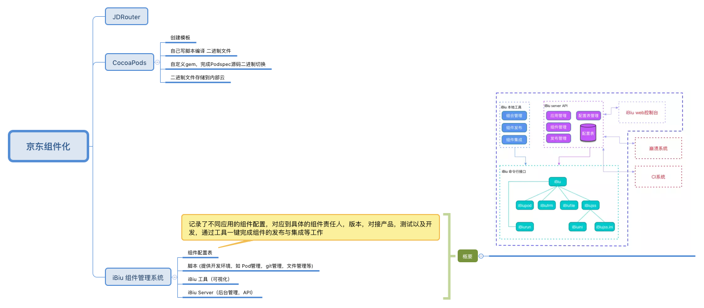
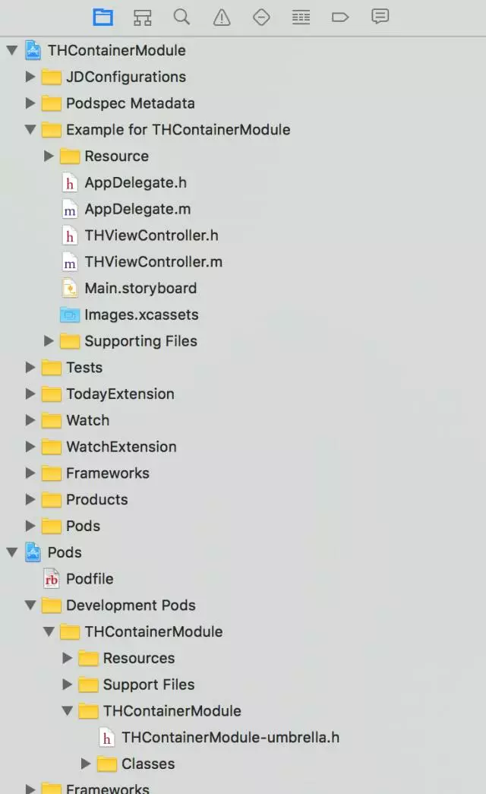
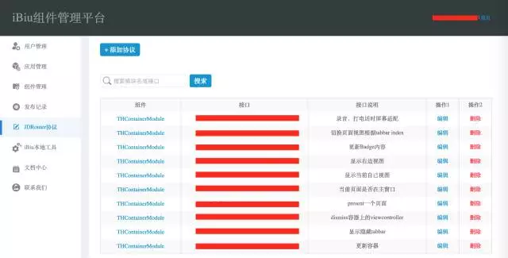
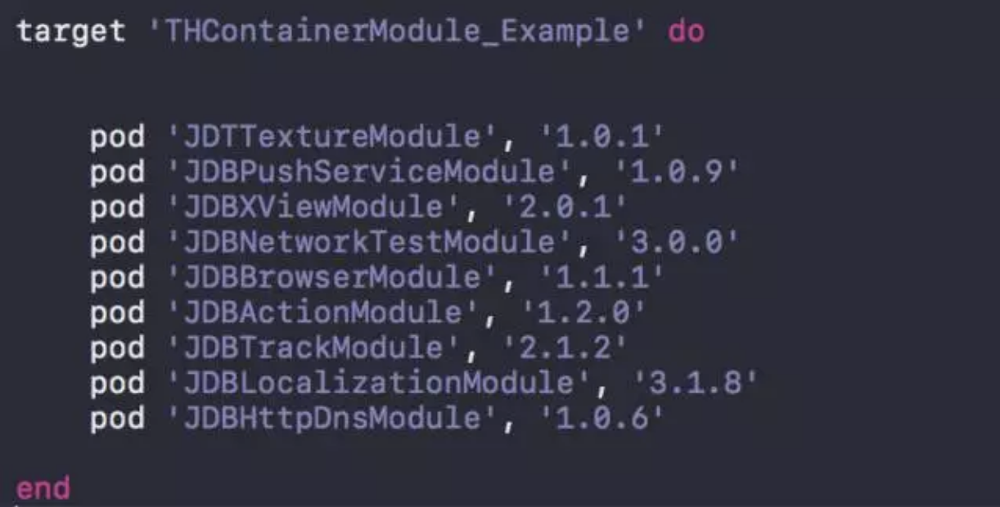
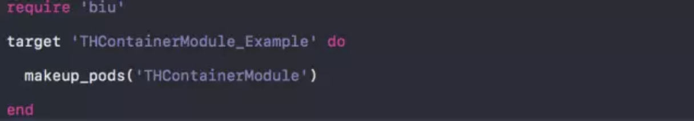
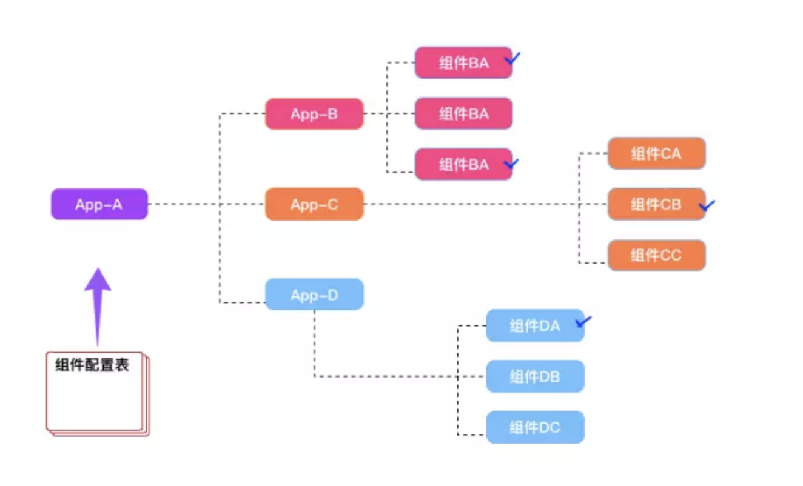
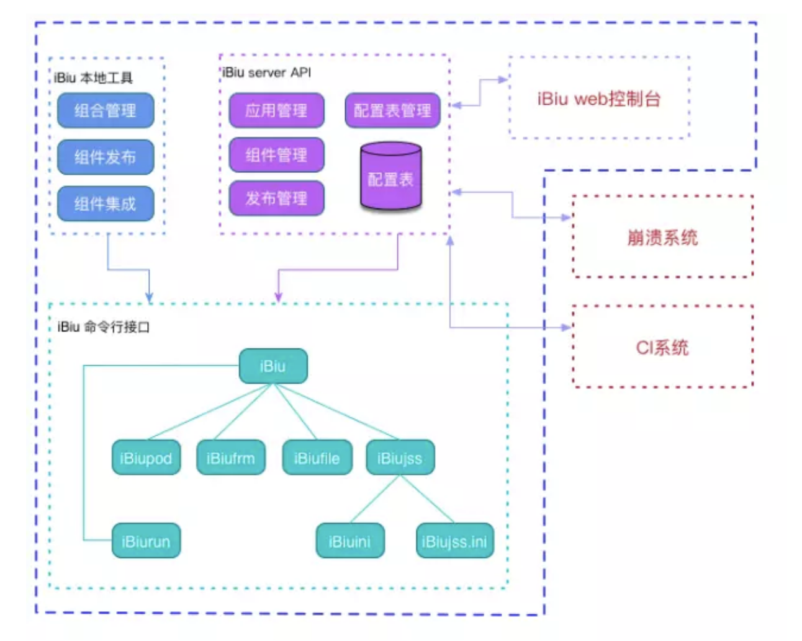
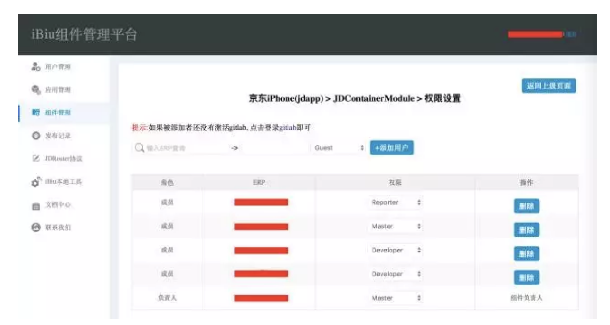
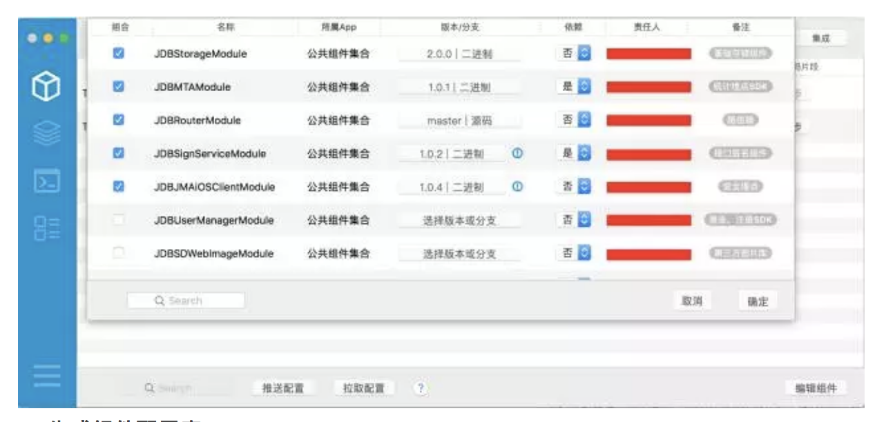

[[toc]]
[TOC]

# 京东组件化方案解析

参考文章

* [京东iOS客户端组件管理实践](https://mp.weixin.qq.com/s?__biz=MzA3ODg4MDk0Ng==&mid=2651113492&idx=1&sn=225210c9b3acbbec99e5cb297a9887d2&chksm=844c61c9b33be8dfecd061e61e2f458cd5fa411309d7b838f8d297249b38bb1aa0f0f35156e5&mpshare=1&scene=1&srcid=0727NBHxlOk9lUxcAC0f4DaG#rd)

## 京东方案解析

京东组件化方案做的比较彻底，包含了项目解耦、二进制打包、组件自动化管理系统等等，其中最重要的是组件自动化管理系统。

##### 

主要由三个方面组成：

* JDRouter
* CocoaPods管理
* iBiu 组件管理系统

京东的开发模板：

iBiu组件管理平台：

其中我们可以借鉴吸收的部分：

- 二进制化
- 开发模板（代替目前的壳工程）
- 组件自动管理系统
  - 组件配置
  - 前端管理系统
  - 后台管理系统

京东的组件化方案中，最重要的部分就是 **组件管理平台**，这个也是我们下一步要搭建的。

## iBiu组件管理系统
### 组件配置表

**组件配置表**用来记录App包含的组件，及其依赖，用来代替Podfile，如图：

组件配置表概念图示：

### iBiu 系统设计

iBiu系统是对于Cocoapods 配置说明查询、组件版本依赖、统一集成等等做到自动管理，提高开发效率。

主要由三大块内容构成：

- 脚本（提供开发环境，如果 pod 管理，git 管理，文件管理等）
- iBiu 工具（可视化）
- iBiu Server（后台管理，API）

京东关于组件管理平台介绍的也不是很多，这块还是需要我们根据自己的业务好好思考思考。

## 我们接下来要做的事情：

1. 混合业务代码抽离
2. 抽离 景区、周边游、攻略 项目
3. 把其余项目抽离一个仓库内，不做细分
4. 抽离 公共项目，比如 我的、目的地、首页、行程助手等
5. 去除壳工程，用脚本把主工程环境与项目代码结合到一起
6. 搭建我们自己的组件管理平台（初步规划，还需要多思考）
   * **组件管理展示平台，类似URL 2.0**
   * **组件自动发布功能**
   * **工程自动配置组件版本打包**