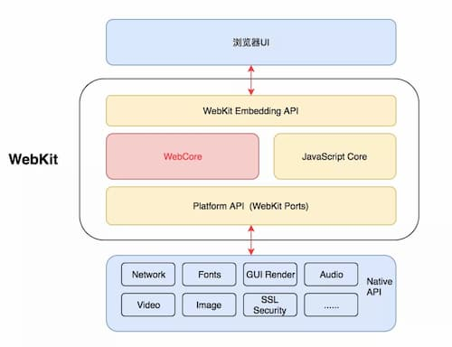
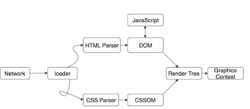
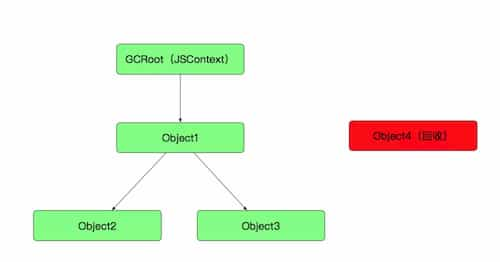
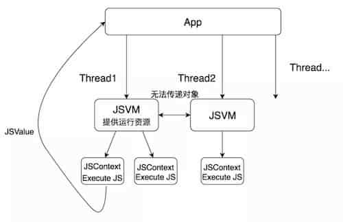
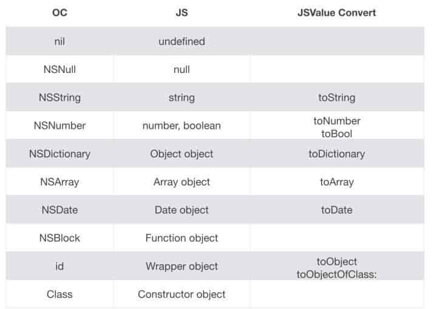
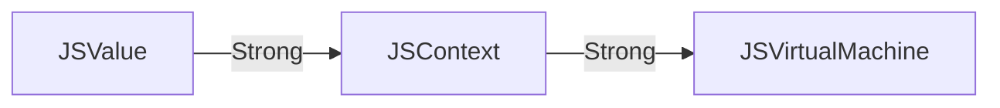
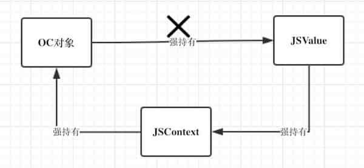
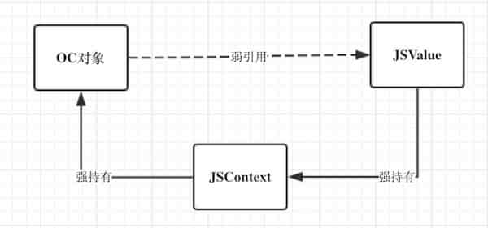

[[toc]]

# JavaSrciptCore

JavaScriptCore 是 JS引擎，用于解析JS，类似Chrome的 V8。


## 背景知识

### WebKit框架



### WebKit的渲染流程



> 首先浏览器通过URL定位到了一堆由HTML、CSS、JS组成的资源文件，通过加载器（这个加载器的实现也很复杂，在此不多赘述）把资源文件给WebCore。之后HTML Parser会把HTML解析成DOM树，CSS Parser会把CSS解析成CSSOM树。最后把这两棵树合并，生成最终需要的渲染树，再经过布局，与具体WebKit Ports的渲染接口，把渲染树渲染输出到屏幕上，成为了最终呈现在用户面前的Web页面。


### JS内存管理

JS的内存管理是GC机制（垃圾回收机制），GC会维护一条引用链，一旦某个对象节点不在链上，就会被释放




## 类解析

### 类基本介绍

| Class                                     | Detail                                                       |                            Detail                            |
| :---------------------------------------- | ------------------------------------------------------------ | :----------------------------------------------------------: |
| JSVirtualMachine                          | JS的虚拟机，可以包含多个JSContext，一个JSVM对应一个线程，不能JSVM之间不能传递数据JSValue等 | 代表一个对象空间，拥有自己的堆结构和垃圾回收机制。大部分情况下不需要和它直接交互，除非要处理一些特殊的多线程或者内存管理问题 |
| JSContext                                 | JS运行环境上下文，只能属于一个 JSVirtualMachine，类似一个js 中window对象 | 代表JavaScript的运行环境，你需要用JSContext来执行JavaScript代码。所有的JSValue都是捆绑在一个JSContext上的 |
| JSValue                                   | JS的值对象，用于OC和JS之间数值类型转换                       | 代表一个JavaScript实体，一个JSValue可以表示很多JavaScript原始类型例如boolean, integers, doubles，甚至包括对象和函数 |
| JSManagedValue                            | 对象管理器，用于处理对象的声明周期                           | 本质上是一个JSValue，但是可以处理内存管理中的一些特殊情形，它能帮助引用技术和垃圾回收这两种内存管理机制之间进行正确的转换 |
| JSExport                                  | 接口导出协议，用于暴露OC方法给JS                             | 这是一个协议，可以用这个协议来将原生对象导出给JavaScript，这样原生对象的属性或方法就成为了JavaScript的属性或方法，非常神奇 |
| JSBase.h / JSContextRef.h / JSObjectRef.h | c结构                                                        |                            c结构                             |


JSContext是JS运行环境，JSValue是JS实体抽象，这两者用的比较多，一个简单的代码示例：

```objective-c
//运行JS代码
JSContext *context = [[JSContext alloc] init];
[context evaluateScript:@"var num = 5 + 5"];
[context evaluateScript:@"var names = ['Grace', 'Ada', 'Margaret']"];
[context evaluateScript:@"var triple = function(value) { return value * 3 }"];
JSValue *tripleNum = [context evaluateScript:@"triple(num)"];

//示例2，使用字面量
NSString *factorialScript = loadFactorialScript();
[_context evaluateScript:factorialScript];
JSValue *function = _context[@"factorial"];
JSValue *result = [function callWithArguments:@[@5]];
NSLog(@"factorial(5) = %d", [result toInt32]);

```


OC中调用JS代码示例

```
//js代码 Hello.js
function printHello() {
}

//OC中调用 JS方法
NSString *scriptPath = [[NSBundle mainBundle] pathForResource:@"hello" ofType:@"js"];
NSString *scriptString = [NSString stringWithContentsOfFile:scriptPath encoding:NSUTF8StringEncoding error:nil];

JSContext *context = [[JSContext alloc] init];
[context evaluateScript:scriptString];

//运行 printHello
JSValue *function = self.context[@"printHello"];
[function callWithArguments:@[]];

```


JS调用OC代码，两种方式

* Blocks JS functions
  * Avoid capturing JSValues, Prefer passing as arguments 或使用 JSManagedValue
  * Avoid capturing JSContexts, Use + [JSContext currentContext]
* JSExport Protocol

``` objective-c
//Blocks JS functions

//native
context[@"makeNSColor"] = ^(NSDictionary *rgb){
    float r = [colors[@"red"] floatValue];
    float g = [colors[@"green"] floatValue];
    float b = [colors[@"blue"] floatValue];
    return [NSColor colorWithRed:(r / 255.0)
	green:(g / 255.0f)
	blue:(b / 255.0f)
	alpha:1.0];
};

//js
var colorForWord = function(word) {
    if (!colorMap[word])
        return;
    return makeNSColor(colorMap[word]);
};


//JSExport Protocol, 详见下面JSExport
```


### 线程安全

JavaScriptCore 是线程安全的，唯一需要注意的有两点

- JSVirtualMachine 是在一个独立的线程执行，多个JSVirtualMachine对应多个线程，之间的JSContext不共享和不能传递
- JSVirtualMachine 之间不能传递 JSValue，但是JSVirtualMachine下的多个JSContext可以传递JSValue


线程运行图示例




### 内存管理

* JSValue 的生命周期不需要在OC中手动维护，JSContext会使用JS的GC垃圾回收机制管理
* 不要强引用JSValue，容易造成retain circle，如果要引用，需要使用JSManagedValue
* 在JSContext的函数中，不要直接引用外部的JSContext，会造成retain circle，需要使用 `[JSContext currentContext]`来获取JSContext


### JSContext

JSContext是JS运行的上下文环境，其中有几个点需要注意

* 执行JS代码，是调用 `evaluateScript:` 和 `evaluateScript:withSourceURL:`，其中第二个方法的URL参数用于Debug时展示信息使用
* globalObject，它返回当前执行JSContext的全局对象，例如在WebKit中，JSContext就会返回当前的Window对象。该类保存了所有的变量和函数。
* exceptionHandler，捕捉JS错误


### JSValue

JSValue是对一个JS值的抽象，是一个非常重要的类。内部提供了大量的方法用于JS与OC之间的转换。

OC与JS数据类型转换对照表：




内部大量方法用于转换和判断，具体可以参见[JSValue API](https://developer.apple.com/documentation/javascriptcore/jsvalue?language=objc)


### JSManagedValue

**OC的内存管理是ARC机制，JS的是GC机制。** JSContext中的JSValue生命周期属于GC管理，当相关对象不在引用链上时就会被释放。

相关类的引用关系：



JSValue是不需要OC来保存管理的，一般不要直接 用 property(strong) JSValue ，这样很容易造成循环引用（使用 JSExport的类，如果持有JSValue，必然会造成retain circle，因为JSVaule -> JSContext -> OC Export -> JSValue）。 


**如果要在OC上保存 JSValue，就需要使用 JSManagedValue 。** JSManagedValue 是有条件的强引用( conditional retain )  JSValue  ：

- JS生命图里是包含 JSValue 
- OC生命周期里持有 JSManagedValue 

当上面两个条件满足其中一个时，JSManagedValue 就会持有JSValue，但是如果这两个条件都不满足，则会 JSManagedValue的 value属性就会被自动置空。 

需要注意的时，要满足 conditional retain 必须调用 addManagedReference:withOwner: 否则当 JS生命图中不包含 JSValue时，JSManagedValue就会自动释放 JSValue 


当 OC对象持有 了JSValue，而该OC对象又被 JSContext 持有时，就会造成retain circle



为了避免这种情况，就需要使用 JSMagagedValue




### JSExport

使用JSExport来暴露OC对象给JS，供JS直接调用。

JSExport本身是一个空的协议，使用时必须自定义协议继承JSExport，然后在该协议内暴露OC属性和方法供JS调用。OC类中属性和方法都不会自动转换，必须用自定义协议继承 JSExport ，然后协议内暴露出的方法和类，才会被转换

```objective-c
//OC
@protocol MyPointExports <JSExport>
@property double x;
@property double y;
- (NSString *)description;
+ (MyPoint *)makePointWithX:(double)x
                          y:(double)y;
@end
    
    
//对应的JS调用
point.x;
point.x = 10;
point.description();
MyPoint.makePointWithXY(0, 0);

//OC, MyPoint 类
@interface MyPoint : NSObject <MyPointExports>
- (void)myPrivateMethod;  // Not visible to JavaScript code.
@end
@implementation MyPoint
...
@end
    
//在 JSContext 中，JS调用 MyPoint 实例方法
JSContext *context = [[JSContext alloc] init];
[context evaluateScript:geometryScript];
MyPoint *point1 = [[MyPoint alloc] initWithX:0.0 y:0.0];
MyPoint *point2 = [[MyPoint alloc] initWithX:1.0 y:1.0];
JSValue *function = context[@"euclideanDistance"];
JSValue *result = [function callWithArguments:@[point1, point2]];

//在 JSContext 中，JS调用 MyPoint 类方法
context[@"MyPoint"] = [MyPoint class];
JSValue *function = context[@"midpoint"];
JSValue *jsResult = [function callWithArguments:@[point1, point2]];
MyPoint *midpoint = [jsResult toObject];


// geometry.js，对应的JS文件
var euclideanDistance = function(p1, p2) {
     var xDelta = p2.x - p1.x;
     var yDelta = p2.y - p1.y;
     return Math.sqrt(xDelta * xDelta + yDelta * yDelta);
};
var midpoint = function(p1, p2) {
     var xDelta = (p2.x - p1.x) / 2;
     var yDelta = (p2.y - p1.y) / 2;
     return MyPoint.makePointWithXY(p1.x + xDelta, p1.y + yDelta);
};

```


#### 转换规则

* Enumeration of methods and properties to export to JavaScript
* @property → JavaScript getter/setter
* Instance method → JavaScript function
* Class methods → JavaScript functions on global class object


#### OC的方法名转成JS的遵守以下规则

* 所有的冒号会被去除
* 冒号后的标示中小写字母会被转成大写字母

比如，`doFoo:withBar:` 转成 `doFooWithBar`。

如果需要自定义JS名字，需要使用 JSExportAs

```objective-c
@protocol MyClassJavaScriptMethods <JSExport>
JSExportAs(doFoo,
- (void)doFoo:(id)foo withBar:(id)bar
);
@end

```


## 其他


### Web获取JSContext

* UIWebView，使用以下方法获取

  ```objective-c
  JSContext *context = [webView valueForKeyPath:@"documentView.webView.mainFrame.javaScriptContext”];
  
  ```

* WKWebView 无法获取到 JSContext，因为WK是在一个独立的进程里，获取不到 JSContext 对象


###Debug方法

Safari浏览器可以调试JSContext，可以打开*Automatically Show Web Inspector for JSContexts*和*Automatically Pause Connecting to JSContexts*开关，App运行到JSContext开关时，Safari会自动打开调试工具。

在Debug页面内，如果要显示js，则可以用 `evaluateScript:withSourceURL:` 方法，在资源标签内会把对应 js放到 xork 文件内供调试

```objective-c
//在调试工具中的JS文件中不会显示
[self.context evaluateScript:@"var num = 5 + 5"];     
//var num = 5 + 5 会放到 xork中显示
[self.context evaluateScript:@"var num = 5 + 5" withSourceURL:[NSURL URLWithString:@"xork"]];        

// 添加了一个sourceURL参数 , 用于debug和异常抛出时标记JS路径，一般可以放到Debug内，用 evaluateScript:withSourceURL: 来调试 JSContext的JS
- (JSValue *)evaluateScript:(NSString *)script withSourceURL:(NSURL *)sourceURL;

```


### JSPatch

JSPatch是基于JSContext来调用JS，但是没有对所有类实现JSExport协议，而是采用动态转发机制实现。


## 参考资料

[JavaScriptCore - Apple](https://developer.apple.com/documentation/javascriptcore?language=objc)

[Integrating JavaScript into Native Apps - WWDC2013](https://developer.apple.com/videos/play/wwdc2013/615/)

[JavaScriptCore-nshipster](https://nshipster.cn/javascriptcore/)

[深入理解JavaScriptCore](https://mp.weixin.qq.com/s?__biz=MjM5NjQ5MTI5OA==&mid=2651748649&idx=2&sn=3909ebe4e33eed50fe5d75b61a3d4203&chksm=bd12a0648a652972bf89f9bfc14cfbcaff5aee2fb617e89cc084bd2c1c0a58e5958f39cb32f2&mpshare=1&scene=1&srcid=0823pqsSjBskHA2uyTpSV3KA%23rd)

[iOS 中的 JS](https://zhuanlan.zhihu.com/p/34646281)

[JavaScriptCore 初探](http://liuduo.me/2015/10/24/JavaScriptCore%E5%88%9D%E6%8E%A2/)  JSManagedValue 

[JavaScriptCore引擎深度解析-1-开篇](http://lingyuncxb.com/2018/07/19/JavaScriptCore%E5%BC%95%E6%93%8E%E6%B7%B1%E5%BA%A6%E8%A7%A3%E6%9E%90-1-%E5%BC%80%E7%AF%87/)

[JavaScriptCore引擎深度解析-2-API篇](http://lingyuncxb.com/2018/07/25/JavaScriptCore%E5%BC%95%E6%93%8E%E6%B7%B1%E5%BA%A6%E8%A7%A3%E6%9E%90-2-API%E7%AF%87/)  分析了源码，从源码角度解释了 conditional retain 是怎么实现的 

[JavaScriptCore引擎深度解析3—词法分析篇](http://lingyuncxb.com/2018/07/30/JavaScriptCore%E5%BC%95%E6%93%8E%E6%B7%B1%E5%BA%A6%E8%A7%A3%E6%9E%90-3-%E8%AF%8D%E6%B3%95%E5%88%86%E6%9E%90%E7%AF%87/)

[JavaScriptCore的学习](http://luoxianming.cn/2016/05/12/javaScriptCore/)

[JSPatch](https://github.com/bang590/JSPatch)

[JSPatch 实现原理详解](https://github.com/bang590/JSPatch/wiki/JSPatch-%E5%AE%9E%E7%8E%B0%E5%8E%9F%E7%90%86%E8%AF%A6%E8%A7%A3)

