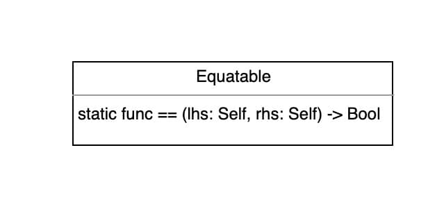
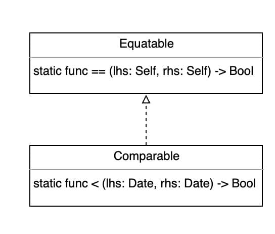
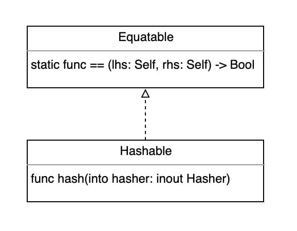

[[toc]]
[toc]


## Equatable




对自定义结构体、枚举、类使用相等运算符（==、!=）时，需要遵守该协议。

注：只需要实现 `==`运算符即可（`!=` 为 `==` 的逆运算）


```swift
//协议定义
static func == (lhs: Self, rhs: Self) -> Bool
static func != (lhs: Self, rhs: Self) -> Bool
```


```swift

//示例
class IntegerRef: Equatable {
    let value: Int
    init(_ value: Int) {
        self.value = value
    }

  	//实现 == 运算符函数
    static func == (lhs: IntegerRef, rhs: IntegerRef) -> Bool {
        return lhs.value == rhs.value
    }
}
```


### 自动合成

当结构体、枚举显式声明遵守`Equatable`后，以下情况会自动合成 `==` 运算符函数：

* 结构体，所有存储属性都遵守 `Equatable`协议
* 枚举，所有的关联值都遵守 `Equatable`协议

```swift
struct StreetAddress {
    let number: String
    let street: String
    let unit: String?

    init(_ number: String, _ street: String, unit: String? = nil) {
        self.number = number
        self.street = street
        self.unit = unit
    }
}

//显式声明遵守 Equatable协议，隐式自动合成 == 运算符函数
extension StreetAddress : Equatable {
    
}

```


## Comparable





比较运算符函数：`<`, `<=`, `>=`, `>`，Comparable 继承自 Equatable。

自定义时，只需要需要实现 `<`, `==` （其他运算符函数（`<=`, `>=`, `>`）系统会自动实现）。

```swift
struct Date {
    let year: Int
    let month: Int
    let day: Int
}

// Comparable 只需要实现 <, == 两个运算符函数
extension Date: Comparable {
  	//实现 <
    static func < (lhs: Date, rhs: Date) -> Bool {
        if lhs.year != rhs.year {
            return lhs.year < rhs.year
        } else if lhs.month != rhs.month {
            return lhs.month < rhs.month
        } else {
            return lhs.day < rhs.day
        }
    }
  
  	// Comparable 继承自 Equatable，所以必须实现 ==
    static func == (lhs: Date, rhs: Date) -> Bool {
      return lhs.year == rhs.year && lhs.month == rhs.month
          && lhs.day == rhs.day
    }
}
```


## Hashable





### Hasher

Hasher是Swift提供的哈希函数，根据输入值产出一个唯一的哈希值

```swift


var hasher = Hasher()
//feed
hasher.combine(23)
hasher.combine("Hello")
//产出哈希值，Int类型
let hashValue = hasher.finalize()
```


### Hashable

哈希协议，继承自`Equatable`，必须实现 `==` 和  `hash(into hasher: inout Hasher)` 方法。

```swift

struct GridPoint {
    var x: Int
    var y: Int
}


extension GridPoint: Hashable {
  
  	//实现 == 运算符函数
    static func == (lhs: GridPoint, rhs: GridPoint) -> Bool {
        return lhs.x == rhs.x && lhs.y == rhs.y
    }

  	//实现 hash方法，注意这里只需要调用combine方法即可
    func hash(into hasher: inout Hasher) {
        hasher.combine(x)
        hasher.combine(y)
    }
}

```


#### 自动合成

当显式声明Hashable后，满足以下条件会实现自动合成

* 结构体，所有存储属性都遵守 `Hashable`协议
* 枚举，所有的关联值都遵守 `Hashable`协议


## Tuple Comparison

### Equatable

Swift对元组实现了2-6个元素的比较，超过6个则无法比较，必须自定义比较方法。

注：对元组也可以用 `<`, `<=`, `>`, `>=`比较运算符

> 思考一个问题，能否对元组进行extension，使其可以对七个元素进行比较？
>
> 答案是不能。Swift中结构类型有两种：*named types* 和 *compound types*，*named types* 分为结构体、枚举、类、协议， *compound types*分为函数和元组。extension只能对named types进行扩展。
>
> 参考：
>
> * [Can I extend Tuples in Swift?](https://stackoverflow.com/questions/28317625/can-i-extend-tuples-in-swift)
>
> * [Types](https://docs.swift.org/swift-book/ReferenceManual/Types.html)
> * [Equatable](https://developer.apple.com/documentation/swift/equatable)
> * [Basic Operators](https://docs.swift.org/swift-book/LanguageGuide/BasicOperators.html)


### Comparable

元组实现了2-6个元素的 比较运算符函数`<`, `<=`, `>=`, `>`