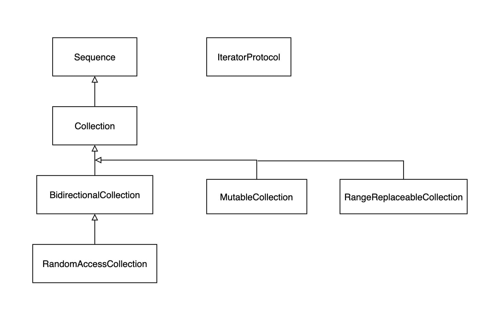

# Sequence and Collection Protocols


Swift是一门高度抽象化的语言，设计了大量的协议。数组的功能基本都由各种协议实现。

了解协议，有助于帮助我们记忆常用API方法。


## 集合相关协议

集合由大量协议构成，大致介绍如下：

* `Sequence`，序列集合，不可重复多次遍历
* `Collection`，一种可重复多次遍历，可支持索引访问的Sequence
* `IteratorProtocol`，迭代器，Sequence 使用该协议实现迭代遍历（for-in结构是使用该迭代器协议实现）
* `BidirectionalCollection`，支持反向遍历的 Collection
* `RandomAccessCollection`，随机访问的Collection
* `MutableCollection`，支持下标修改元素的Collection
* `RangeReplaceableCollection`，支持区间修改元素的Collection


继承关系：


## 举例

这里列举了Sting,Array, Dictionary 遵守的相关协议，只列举Sequence相关。

### String

String遵守了以下协议（只列举Sequence相关）：

* `RangeReplaceableCollection`


### Array

Swift中Array遵守了以下协议（只列举Sequence相关）：

* `MutableCollection`
* `RandomAccessCollection`
* `RangeReplaceableCollection`


### Dictionary

* `Collection`


## 协议介绍

### IteratorProtocol

迭代器，Sequence的迭代器for-in就是用该协议实现。

```swift
//自定义需要实现的方法，Required
associatedtype Element
mutating func next() -> Self.Element?
```


### Sequence