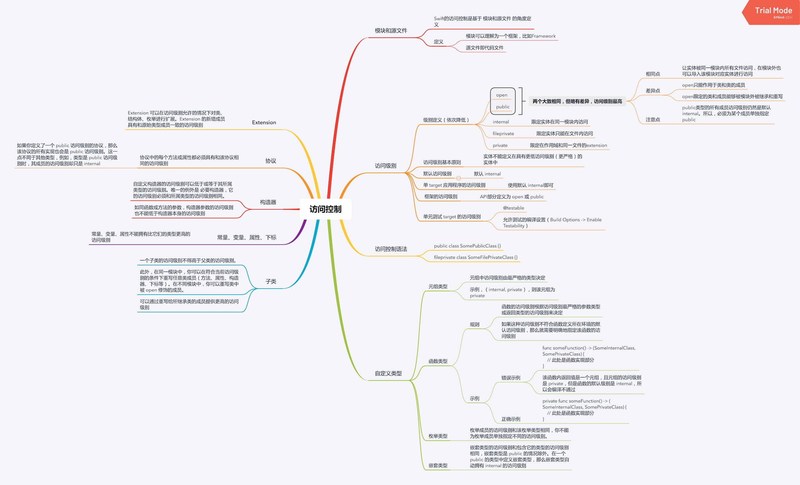

[[toc]]
[toc]


## 泛型

泛型是Swift非常强大的特性之一。

关键字：`< >` , `associatedtype`, `where`

```swift
/*
	基本格式：<T>声明一个泛型类型T，内部即可使用该类型
	命名规则：大写字母开头，驼峰式；有表示意义时，Dictionary<Key, Value>，Array<Element>，无表示意义时，通常用单个字符，例如 T、U、V
*/

//函数泛型
func swapTwoValues<T>(_ a: inout T, _ b: inout T) {
    let temporaryA = a
    a = b
    b = temporaryA
}


//类型泛型
struct Stack<Element> {
    var items = [Element]()
    mutating func push(_ item: Element) {
        items.append(item)
    }
    mutating func pop() -> Element {
        return items.removeLast()
    }
}
//类型约束，可声明泛型为某类或遵守指定协议
func someFunction<T: SomeClass, U: SomeProtocol>(someT: T, someU: U) {
    // 这里是泛型函数的函数体部分
}
//泛型扩展，可在扩展中直接使用已定义的泛型，不需要重新声明
extension Stack {
    var topItem: Element? {
        return items.isEmpty ? nil : items[items.count - 1]
    }
}


/*
	关联类型：关联类型是泛型的一种，用于协议中使用。协议中不能定义泛型，必须用关联类型
	关键字：associatedtype
*/
protocol Container {
    associatedtype Item		//声明一个关联类型
    mutating func append(_ item: Item)
    var count: Int { get }
    subscript(i: Int) -> Item { get }
}


//关联类型也可增加约束，指定遵守协议或某类，跟泛型相同
//扩展内，也可直接用已定义的关联类型
protocol Container {
    associatedtype Item: Equatable		//声明关联类型遵守 Equatable 协议
    mutating func append(_ item: Item)
    var count: Int { get }
    subscript(i: Int) -> Item { get }
}


/*
	where语句
	where后可跟多个约束语句，泛型、关联类型支持where语句，可用于函数、类型、扩展、下标等
*/
//基本格式
where a == b 		//限制类型相同
where where Element: Equatable		//限制遵守协议

//限制 C1.Item 与 C2.Item 类型相同，限制 C1.Item 遵守 Equatable 协议，注意where语句位置
func allItemsMatch<C1: Container, C2: Container>
    (_ someContainer: C1, _ anotherContainer: C2) -> Bool
    where C1.Item == C2.Item, C1.Item: Equatable {
}

//扩展，where语句
extension Container where Item: Equatable {
    func startsWith(_ item: Item) -> Bool {
        return count >= 1 && self[0] == item
    }
}

```


## 可选链

关键字：`?` , `!`

```swift
//代码示例
//定义，如果 john.residence 为 nil，则整个表达式为nil;如果不为nil，则调用  numberOfRooms
john.residence?.numberOfRooms

//强制解析写法对比，如果使用强制解析，为nil则直接产生运行时错误
john.residence!.numberOfRooms

//通过可选连可调用函数，如果 调用 printNumberOfRooms() 失败，则为nil
if john.residence?.printNumberOfRooms() != nil {
    print("It was possible to print the number of rooms.")
} else {
    print("It was not possible to print the number of rooms.")
}
```


## 错误处理

关键字：`Error`, `throws` , `throw`, `do-catch`, `try`,  `try?`, `try!`

> Notice: Swift 中的错误处理并不涉及解除调用栈，这是一个计算代价高昂的过程。就此而言，**throw 语句的性能特性是可以和 return 语句相媲美的**。


```swift
//关键字解释：
Error:		错误协议，throw抛出的类型必须遵守Error协议，该协议为空协议
throws: 	声明函数为 throwing函数，可以抛出错误
throw:		函数内抛出错误
do-catch: Swift处理错误的一种方式
try: 			用于函数内传递错误
try?: 		处理错误的一种方式，如果返回是错误，则为nil
try!: 		处理错误的一种方式，如果返回错误，则抛出运行时错误

//1. throw使用示例
enum TestSwiftError: Error {
    case invalidName
    case invaildAge
    case invaildOther
}


//使用 throws 声明该函数为throwing函数，只有 throwing 函数可以传递错误。
//任何在某个非 throwing 函数内部抛出的错误只能在函数内部处理。
func vend(name: String?) throws{
    
    guard name != nil else {
        //使用 throw 抛出Error错误类型
        throw TestSwiftError.invalidName
    }
    
    print(name);
}


//2. 处理错误，Swift中有四种处理错误错误方式

//2.1 用 throwing 函数传递错误，即把函数抛出的错误传递给调用此函数调用方，使用try
func canThrowErrors() throws -> String{
    try vend(name: nil)     //使用try关键字，把vend函数的错误传递给canThrowErrors的调用方处理
}

//2.2 用 do-catch 语句处理错误，使用 do-catch,try
//do-catch基本形式
do {
    try expression
    statements
} catch pattern 1 {
    statements
} catch pattern 2 where condition {
    statements
} catch pattern 3, pattern 4 where condition {
    statements
} catch {
    statements
}

//do-catch调用示例
func testDoCatch(){
    do {
        try canThrowErrors()
    } catch TestSwiftError.invalidName {
      	//错误类型为 TestSwiftError.invalidName
        print("invalidName")
    }catch {
      	//如果错误为 TestSwiftError.invalidName 以外的其他错误
        print("Other")
    }
}


//2.3 将错误作为可选类型处理，使用 try? 将错误转化为nil
func testDoCatch(){
  	//当canThrowErrors()抛出错误时，使用try?将错误转化为nil
    let x = try? canThrowErrors()
}

//2.4 禁用错误传递，使用 try! 禁用错误回调，当发生错误时，得到运行时错误
//使用 try! 是确定不会出现错误回调！但是一旦出现错误，则会得到运行时错误
let y = try! canThrowErrors()

```


### 与OC的错误处理

Swift的错误处理机制类似OC的NSError，Swift和OC的NSError机制可以互相捕捉。

**但是，OC的Exception，Swift是不能处理的，必须在OC中处理**！

具体参考：[Handling Cocoa Errors in Swift](https://developer.apple.com/documentation/swift/cocoa_design_patterns/handling_cocoa_errors_in_swift)


## defer

Swift的`defer`语句很有意思。`defer` 语句在即将离开当前代码块时执行一系列语句，无论是以何种方式离开当前代码块（抛出错误、return、break等），都会调用调用`defer`语句。

**`defer`语句用于进行资源清理和避免重复的返回前需要执行的代码。**

`defer`语句注意点：

* defer语句的调用是在 return等语句调用后才调用
* defer语句内不能再有 return/break/抛出错误等语句
* 如果有多个defer语句，则遵循**先声明后调用**的原则，严格按照顺序，从最后一个声明开始依次调用。
* defer语句的调用时机是在即将离开**作用域**时调用，**该作用域可能是 闭包、if语句、guard语句、for语句、try语句、函数等**
* defer语句类似闭包，但是不是闭包，不会持有内部的值


```swift
//defer语句基本使用
func processFile(filename: String) throws {
    if exists(filename) {
        let file = open(filename)
        defer {
            close(file)
        }
        while let line = try file.readline() {
            // 处理文件。
        }
        // close(file) 会在这里被调用，即作用域的最后。
    }
}

//注意 闭包、if语句、guard语句、for语句、try语句
func remove(_ id: ID, acquireLock: Bool) {
    if acquireLock {
        lock.lock()
        defer { lock.unlock() }
      
      	// defer 语句会在即将退出 if 作用域时调用，而不是函数退出时
    }
    tasks[id] = nil
}

//defer语句调用时机会在 return等条件转义语句后执行
func testDefer() {
    var num = 0
    func foo() -> Int {
        defer { num += 1 }      //会在 return 语句后执行
        return num
    }

    let f = foo()
    print("f: \(f)")        //f: 0
    print("num: \(num)")    //num: 1
}
```


参考：[关于 Swift defer 的正确使用](https://onevcat.com/2018/11/defer/)


## 类型转换

关键字：`is` , `as` , `as?` , `as!` , `Any` , `AnyObject`

只用于Class


```swift
//is, 用于检查类型，与OC isKindOf相同
item is Movie		//表达式为 true 或 false

//as, 类型转换，有三种使用场景
//1. 从派生类转换为基类，向上转型（upcasts）
class Animal {}
class Cat: Animal {}
let cat = Cat()
let animal = cat as Animal		// animal 类型为  Animal


//2. 消除二义性，数值类型转换
let num1 = 42 as CGFloat
let num2 = 42 as Int
let num3 = 42.5 as Int
let num4 = (42 / 2) as Double


//3. switch 语句中进行模式匹配
switch animal {
case let cat as Cat:
    print("如果是Cat类型对象，则做相应处理")
case let dog as Dog:
    print("如果是Dog类型对象，则做相应处理")
default: break
}


//向下转换（Downcasting），转换到子类型，as!, as?
//as!，向下转换，如果失败则触发运行时错误
class Animal {}
class Cat: Animal {}
let animal :Animal  = Cat()
let cat = animal as! Cat

//as?, 向下转换，但是转换失败则返回nil，不会触发错误
let animal:Animal = Cat()
if let cat = animal as? Cat{
    print("cat is not nil")
} else {
    print("cat is nil")
}

//Any,AnyObject
//Any,可以表示任何类型，包括函数类型
//AnyObject,可以表示任何类类型的实例
var things = [Any]()
var things = [AnyObject]()

```


## 不透明类型

关键字：`some`

* **不透明类型与协议或泛型是很像的， 只是在协议或泛型前加some**
* 协议或泛型，都可以作为函数返回值，但是如果协议或泛型里包含关联类型或Self，就不能用于比较。Swift的返回值并不是一个指针，所以会对泛型和协议做处理，发生类型擦除，编译器会推断不出来具体类型。
* 不透明类型，不透明类型对应且只能对应一种类型，即不透明类型与某一种类型是绑定的，编译器能推断出类型信息，因此可以用于返回值做相等判断
* 小结，协议或泛型比较灵活，但是作为返回值时会丢失类型信息，因此牵涉到关联类型或Self时，由于丢失了类型信息，编译无法推断出类型，而报错；不透明类型绑定了具体类型，可以理解为编译器记住了类型信息
* An 'opaque' type must specify only 'Any', 'AnyObject', protocols, and/or a base class


```swift

//协议或泛型，都可以作为函数返回值，但是如果协议或泛型里包含关联类型或Self，就不能用于比较。Swift的返回值并不是一个指针，所以会对泛型和协议做处理，发生类型擦除，编译器会推断不出来具体类型。

/*
	协议报错，以下代码会有两个报错
	1. Protocol 'Test' can only be used as a generic constraint because it has Self or associated type requirements
	2. Binary operator '==' cannot be applied to two 'Test' operands
*/
protocol Test{
    associatedtype Item		//关联类型
    func test()
}
struct TestStruct : Test{
    typealias Item = Int
    func test() {
        print("Impletemnt Test")
    }
}
func testProtocol() -> Test{
    let tmp = TestStruct();
    return tmp
    
}

let tmp = testProtocol();
let test_2 = testProtocol();
if tmp == test_2 {
    print("Equal")
}


/*
	泛型报错，以下代码会有1个报错
	1. Binary operator '==' cannot be applied to two 'TestGeneric' operands
*/

struct TestGeneric {
}

func testGeneric<T>(_ a: T) -> T{
    return a
}

let a = testGeneric(TestGeneric())
let b = testGeneric(TestGeneric())
if a == b {
    print("GenericEqual")
}


//不透明类型，以下代码正确
protocol Test: Equatable{
    associatedtype Item
    func test()
}
struct TestStruct : Test{
    typealias Item = Int
    func test() {
        print("Impletemnt Test")
    }
}

//声明返回值为 不透明类型，编译器能推断出类型信息
func testProtocol() -> some Test{
    let tmp = TestStruct();
    return tmp

}

let tmp = testProtocol();
let test_2 = testProtocol();
if tmp == test_2 {
    print("Equal")
}


```


## 自动引用计数

关键字：`weak`、`unowned`

Swift也是使用ARC机制来控制内存引用计数，跟OC ARC机制相同，默认引用都是强引用。

解决循环引用方法：弱引用（weak） 和 无主引用（unowned）。

* weak，与OC相同，内存释放后对应指针会自动置为nil，所以变量一定是Optional类型
* unowed，类似 assign，内存释放后对应指针不会自动置为nil。无主引用通常用于被期望拥有值，即A 无主引用 B，则B初始化赋值后，则应该在A的生命周期内都有值，否则当B释放后，A继续访问B，会引发运行时错误

注，如果被捕获的引用绝对不会变为 nil，应该用无主引用，而不是弱引用。


三种场景：

* 弱引用，**两个属性值都允许为nil**，并会潜在的产生循环强引用
* 无主引用，**一个允许为 nil，另一个不允许为 nil**，并会潜在的产生循环强引用
* 无主引用 + 隐式解包可选值属性，**两个属性都必须有值，并且初始化完成后永远不会为 nil**。在这种场景中，需要一个类使用无主属性，而另外一个类使用隐式解包可选值属性


```swift

//弱引用 weak，声明弱引用的变量必须是 可选类型
class Person {
    let name: String
    init(name: String) { self.name = name }
    var apartment: Apartment?
    deinit { print("\(name) is being deinitialized") }
}

class Apartment {
    let unit: String
    init(unit: String) { self.unit = unit }
    weak var tenant: Person?									//声明弱引用，类型必须是可选类型
    deinit { print("Apartment \(unit) is being deinitialized") }
}


//无主引用 unowned，无主引用类型
class Customer {
    let name: String
    var card: CreditCard?
    init(name: String) {
        self.name = name
    }
    deinit { print("\(name) is being deinitialized") }
}

class CreditCard {
    let number: UInt64
    unowned let customer: Customer					//声明无主引用，该引用要求一定有值
    init(number: UInt64, customer: Customer) {
        self.number = number
        self.customer = customer
    }
    deinit { print("Card #\(number) is being deinitialized") }
}


/*
	无主引用和隐式解包可选值属性
*/
class Country {
    let name: String
    var capitalCity: City!			//声明为隐式解包，默认值为nil
    init(name: String, capitalName: String) {
        self.name = name
        self.capitalCity = City(name: capitalName, country: self)	//由于 capitalCity 默认值为nil，则可以在 init阶段把 self 传入  City
    }
}

class City {
    let name: String
    unowned let country: Country			//声明为无主引用，且该值一定有值
    init(name: String, country: Country) {
        self.name = name
        self.country = country
    }
}


/*
	闭包的循环强引用，闭包捕获列表。

	Swift 有如下要求：只要在闭包内使用 self 的成员，就要用 self.someProperty 或者 self.someMethod()（而不只是 someProperty 或 someMethod()）。这提醒你可能会一不小心就捕获了 self。
*/

lazy var someClosure = {
    [unowned self, weak delegate = self.delegate]		//定义闭包捕获列表，声明 self为 无主引用，delegate 为 弱引用
    (index: Int, stringToProcess: String) -> String in
    // 这里是闭包的函数体
}

```


## 内存安全

**注意，这里讨论的内存冲突均是在单线程的条件下，非多线程下的内存安全。**


### 内存安全定义

* 默认情况下，Swift 会阻止你代码里不安全的行为。例如，Swift 会保证变量在使用之前就完成初始化，在内存被回收之后就无法被访问，并且数组的索引会做越界检查。
* Swift 也保证同时访问同一块内存时不会冲突，通过约束代码里对于存储地址的写操作，去获取那一块内存的访问独占权。因为 Swift 自动管理内存，所以大部分时候你完全不需要考虑内存访问的事情
* 内存访问的冲突会发生在你的代码尝试同时访问同一个存储地址的时侯。同一个存储地址的多个访问同时发生会造成不可预计或不一致的行为。


### 内存冲突发生条件

以下两个同时发生，则会产生内存冲突

* 至少有一个是写访问
* 它们访问的是同一个存储地址
* 它们的访问在时间线上部分重叠


### 内存访问方式

* 瞬时访问，比如访问某个变量
* 长期访问，会在别的代码执行期间持续进行的内存访问

**注，当 一个长期访问 与 一个瞬时访问或长期访问 同时发生时，则会产生内存冲突**


### 内存冲突的几种场景

* In-Out 参数的访问冲突，**in-out参数在函数内属于长期访问**
* 结构体枚举mutating方法里 self 的访问冲突，**mutating方法内对self也是长期访问**
* 属性的访问冲突


#### In-Out 参数的访问冲突

* 一个函数会对它所有的 in-out 参数进行长期写访问。in-out 参数的写访问会在所有非 in-out 参数处理完之后开始，直到函数执行完毕为止。如果有多个 in-out 参数，则写访问开始的顺序与参数的顺序一致。

* 长期访问的存在会造成一个结果，你不能在访问以 in-out 形式传入后的原变量，即使作用域原则和访问权限允许——任何访问原变量的行为都会造成冲突。
* 在函数内，In-out参数是内存长期访问形式，从传入开始（参数传入就开始了，不是到函数内才开始），直到函数结束，在这个期间会持续内存访问。所以**在这个期间内，不能再访问对应参数的原始变量，否则就会造成内存冲突**


#### 结构体枚举mutating方法里 self 的访问冲突

mutating方法内对Self的访问也是长期访问，也是从函数开始持续到函数结束。**所以如果在函数体内有多个对Self的操作同时发生，也会造成内存冲突**


#### 属性的访问冲突

如结构体，元组和枚举的类型都是由多个独立的值组成的，例如结构体的属性或元组的元素。因为它们都是值类型，修改值的任何一部分都是对于整个值的修改，意味着其中一个属性的读或写访问都需要访问整一个值。例如，元组元素的写访问重叠会产生冲突。


```swift


//In-Out 参数的访问冲突，该代码会在运行时报错
var stepSize = 1
func increment(_ number: inout Int) {
    number += stepSize
}

increment(&stepSize)


//结构体枚举mutating方法里 self 的访问冲突
func balance(_ x: inout Int, _ y: inout Int) {
    let sum = x + y
    x = sum / 2
    y = sum - x
}

struct Player {
    var name: String
    var health: Int
    var energy: Int

    static let maxHealth = 10
    mutating func restoreHealth() {
        health = Player.maxHealth
    }
}

extension Player {
    mutating func shareHealth(with teammate: inout Player) {
        balance(&teammate.health, &health)
    }
}

var oscar = Player(name: "Oscar", health: 10, energy: 10)
var maria = Player(name: "Maria", health: 5, energy: 10)
oscar.shareHealth(with: &oscar)  // 错误：oscar 访问冲突


//属性的访问冲突
func balance(_ x: inout Int, _ y: inout Int) {
    let sum = x + y
    x = sum / 2
    y = sum - x
}

struct Player {
    var name: String
    var health: Int
    var energy: Int

    static let maxHealth = 10
    mutating func restoreHealth() {
        health = Player.maxHealth
    }
}

var playerInformation = (health: 10, energy: 20)
balance(&playerInformation.health, &playerInformation.energy)	// 错误：playerInformation 的属性访问冲突，这里 playerInformation.health 需要对 playerInformation 发起写访问；而 playerInformation.energy 也会对 playerInformation 发起写访问，两个写访问重叠了


```


## 访问控制

### 模块和源文件

Swift的访问控制是基于 模块和源文件 的角度定义

* 模块，模块可以理解为一个框架，比如Framework
* 源文件即代码文件


### 访问级别


| 级别依次降低 |                                                              |
| ------------ | ------------------------------------------------------------ |
| open         | 让实体被同一模块内所有文件访问，在模块外也可以导入该模块对应实体进行访问，与public类似，但open只能作用于类和类的成员，且限定的类和成员能够被模块外被继承和重写 |
| public       | public类型的所有成员访问级别仍然是默认 internal。所以如果对某个成员开放，需要单独指定 public |
| internal     | 限定实体在同一模块内访问，为默认访问级别                     |
| fileprivate  | 限定实体只能在文件内访问                                     |
| private      | 限定在作用域和同一文件的extension                            |


访问级别基本原则，实体不能定义在具有更低访问级别（更严格）的实体中。





## 高级运算符

### 位运算符

* Bitwise NOT Operator（按位取反运算符），~
* Bitwise AND Operator（按位与运算符），&
* Bitwise OR Operator（按位或运算符），|
* Bitwise XOR Operator（按位异或运算符），^
* Bitwise Left and Right Shift Operators（按位左移、右移运算符），<<, >>


### 溢出运算符

* 溢出加法 &+
* 溢出减法 &-
* 溢出乘法 &*


### 运算符函数

* 运算符重载，类和结构体可以为现有的运算符提供自定义的实现
* 前缀和后缀运算符，关键字 `prefix`
* 自定义运算符，除了实现标准运算符，在 Swift 中还可以声明和实现自定义运算符。可以用来自定义运算符的字符列表请参考 运算符。新的运算符要使用 operator 关键字在全局作用域内进行定义，同时还要指定 prefix、infix 或者 postfix 修饰符
* 自定义中缀运算符的优先级

