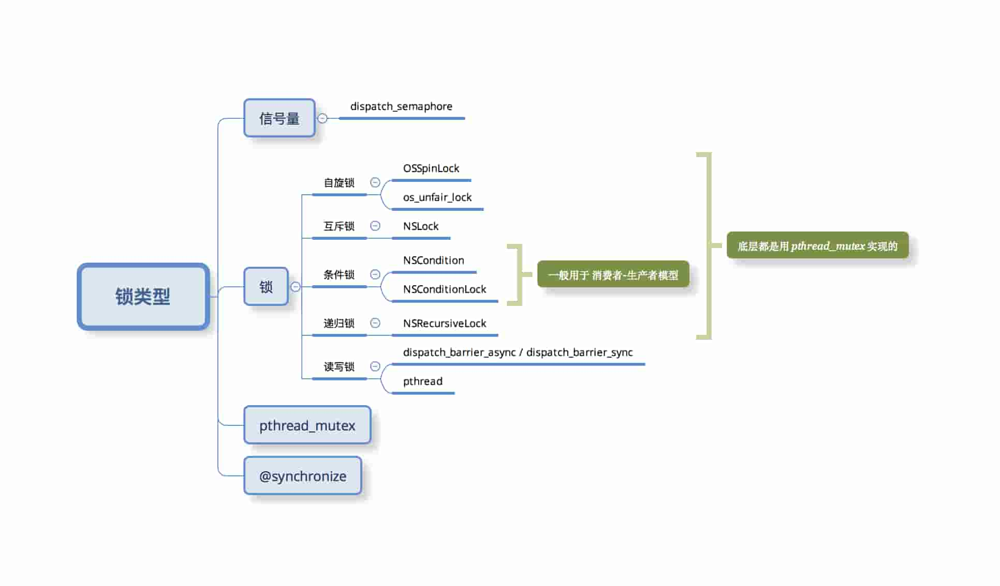

[[toc]]

[TOC]


# iOS锁总结


iOS开发中关于锁整理了下，有以下几种：



比价常用的是：

* dispatch_semaphore
* NSLock
* NSCondition, NSConditionLock
* 读写锁
* NSRecursiveLock
* @synchronize


## **自旋锁**

有一个经典的例子来比较清晰的解释自旋锁：

> A，B两个人合租一套房子，共用一个厕所，那么这个厕所就是共享资源，且在任一时刻最多只能有一个人在使用。当厕所闲置时，谁来了都可以使用，当A使用时，就会关上厕所门，而B也要使用，但是急啊，就得在门外焦急地等待，急得团团转，是为“自旋”，这也是要求锁的持有时间尽量短的原因！


就是线程A、线程B，当线程A进入临界区后，线程B不休眠而进入自旋，不断检测锁的状态，直到线程A释放锁，线程B立即获得锁而进入临界区。如果用互斥锁，会导致线程B进入休眠，引入上下文切换，会消耗CPU资源和时间，但是如果临界区的执行时间很短，则让线程B忙等的效率会更高。因此在临界区执行时间很短的情况下，用自旋锁效率会很高。不过有一点，自旋锁在单核CPU上没有意义，最新的iPhoneX 用的A11 Bionic处理器为六核。


自旋锁在iOS中使用**OSSpinLock**实现，但是在 [深入理解 iOS 开发中的锁](https://bestswifter.com/ios-lock/) 一文中说现在的iOS版本中，自旋锁会导致优先级翻转问题。

> 优先级翻转，是一种不希望发生的任务调度状态。在该种状态下，一个高优先级任务间接被一个低优先级任务所抢先(preemtped)，使得两个任务的相对优先级被倒置。
>
> 这往往出现在一个高优先级任务等待访问一个被低优先级任务正在使用的临界资源，从而阻塞了高优先级任务；同时，该低优先级任务被一个次高优先级的任务所抢先，从而无法及时地释放该临界资源。这种情况下，该次高优先级任务获得执行权。

> 新版 iOS 中，系统维护了 5 个不同的线程优先级/QoS: background，utility，default，user-initiated，user-interactive。高优先级线程始终会在低优先级线程前执行，一个线程不会受到比它更低优先级线程的干扰。这种线程调度算法会产生潜在的优先级反转问题，从而破坏了 spin lock。


使用 `OSSpinLock` 的示例：

```objective-c
#import <libkern/OSAtomic.h>   

OSSpinLock spinLock = OS_SPINLOCK_INIT;

OSSpinLockLock(&spinLock);
OSSpinLockUnlock(&spinLock);
```


由于`OSSpinLock`不再安全（不过其实出现问题的概率相对比较低），苹果推出了 `os_unfair_lock`，不过该API需要 **iOS10**及其以上，另外文档说该API不会自旋等待（所以严格意义上不是自旋锁？？）。

> Replacement for the deprecated OSSpinLock. **Does not spin on contention but waits in the kernel to be woken up by an unlock.**

使用示例：

```objective-c
#import <os/lock.h>
 
os_unfair_lock unfairLock = OS_UNFAIR_LOCK_INIT;     
os_unfair_lock_lock(&unfairLock);     
os_unfair_lock_unlock(&unfairLock);
```


## **dispatch_semaphore**

> 信号量(Semaphore)，有时被称为信号灯，是在多线程环境下使用的一种设施，是可以用来保证两个或多个关键代码段不被并发调用。在进入一个关键代码段之前，线程必须获取一个信号量；一旦该关键代码段完成了，那么该线程必须释放信号量。其它想进入该关键代码段的线程必须等待直到第一个线程释放信号量。


```objective-c
dispatch_semaphore_t semaphore = dispatch_semaphore_create(1);

dispatch_semaphore_wait(semaphore, DISPATCH_TIME_FOREVER);
dispatch_semaphore_signal(semaphore);
```


### **信号量与互斥锁的区别**

​	信号量为1时，使用起来感觉跟互斥锁差不多，但其实两者的设计理念是不同的。**互斥锁管理的是资源的使用权，而信号量管理的是资源的数量**。比如厕所，当有人使用时，其他人就进不去了，而厨房同时允许多人使用。

​	另外，信号量也是服务于多个线程间的执行逻辑顺序，比如，a源自一个线程，b源自另一个线程，计算c = a + b也是一个线程。（即一共三个线程），显然，第三个线程必须等第一、二个线程执行完毕它才能执行，这个时候就可以用信号量来解决（当然也可以用dispatch_group）

```objective-c
int a, b, c;
void geta()
{
    a = calculatea();
    semaphore_increase();		//信号量 +1
}

void getb()
{
    b = calculateb();
    semaphore_increase();		//信号量 +1
}


void getc()
{
  	//由于初始信号量为0，那么这里必须等到前两个函数执行 increase操作后，才能继续执行
    semaphore_decrease();		
    semaphore_decrease();
    c = a + b;
}

t1 = thread_create(geta);
t2 = thread_create(getb);
t3 = thread_create(getc);

```

​	总结下，信号量一方面管理资源的数量，另一方面也可用于多个线程的执行逻辑顺序；而锁管理的是资源的使用权。信号量与互斥锁的设计理念是不同的，只不过当信号量为1时，可以当互斥锁用，不过这个时候直接用互斥锁更好。`dispatch_group`底层也是使用信号量实现的。


## 条件锁

### 生产者消费者模式

> 某个模块负责产生数据，这些数据由另一个模块来负责处理（此处的模块是广义的，可以是类、函数、线程、进程等）。产生数据的模块，就形象地称为生产者；而处理数据的模块，就称为消费者。单单抽象出生产者和消费者，还够不上是生产者／消费者模式。该模式还需要有一个缓冲区处于生产者和消费者之间，作为一个中介。生产者把数据放入缓冲区，而消费者从缓冲区取出数据。
>
> 大概的结构如下图。


### **NSCondition**

> `NSCondition` 的底层是通过条件变量(condition variable) `pthread_cond_t` 来实现的。条件变量有点像信号量，提供了线程阻塞与信号机制，因此可以用来阻塞某个线程，并等待某个数据就绪，随后唤醒线程，比如常见的生产者-消费者模式。


Demo示例，模仿生产者-消费者模式

```objective-c
NSCondition *condition = [NSCondition new];

- (void)consume{
     
  	NSLog(@"consume");
    [condition lock];
    
  //这里一定要对条件进行判断，以防错误信号唤起
    while (dataArray.count == 0) {
        NSLog(@"consume wait");
        [condition wait];
    }
    
    NSLog(@"consume processing data");
    
    [dataArray removeAllObjects];
    NSLog(@"consume dataArray:%@",dataArray);
    
    [condition unlock];

}

- (void)product{
    
  	sleep(1);
  
  	NSLog(@"product");
    [condition lock];
    
    NSLog(@"product sleep");
    sleep(5);
    
    NSLog(@"product processing data");
    [dataArray addObject:@"1"];
    
    NSLog(@"product signal");
    [condition signal];
    [condition unlock];
}

```


官网文档说，当线程等待一个条件时，线程会解锁并被阻塞，当收到条件信号后，线程会重新获得锁。另外有一个注意点，由于可能存在信号干扰，把线程错误唤起，所以代码内要对条件进行判断，以免错误信号唤起。

>  **When a thread waits on a condition, the condition object unlocks its lock and blocks the thread. When the condition is signaled, the system wakes up the thread.** The condition object then reacquires its lock before returning from the wait or waitUntilDate: method. Thus, from the point of view of the thread, it is as if it always held the lock.
>
>  **There are timing issues involved in signaling that may cause false signals to appear.**


### **NSConditionLock**

> `NSConditionLock` 借助 `NSCondition` 来实现，它的本质就是一个生产者-消费者模型。“条件被满足”可以理解为生产者提供了新的内容。`NSConditionLock` 的内部持有一个 `NSCondition` 对象，以及 `_condition_value` 属性，在初始化时就会对这个属性进行赋值


官网生产者消费者模式伪代码：

```objective-c
//producer
id condLock = [[NSConditionLock alloc] initWithCondition:NO_DATA];
 
while(true)
{
    [condLock lock];
    /* Add data to the queue. */
    [condLock unlockWithCondition:HAS_DATA];
}


//consumer
while (true)
{
    [condLock lockWhenCondition:HAS_DATA];
    /* Remove data from the queue. */
    [condLock unlockWithCondition:(isEmpty ? NO_DATA : HAS_DATA)];
 
    // Process the data locally.
}

```

注意，官网的示例代码中，消费者是先从缓冲区把自己的数据拿下来，然后如果有数据则通知其他消费者继续取数据，这里实现的比较好。


OC代码示例：

```objective-c
static const NSInteger kConditionLockNoData = 0;
static const NSInteger kConditionLockHaveData = 1;

NSConditionLock *conditionLock =  [[NSConditionLock alloc] initWithCondition:kConditionLockNoData];

- (void)consume{
  
    NSLog(@"consume");
    [conditionLock lockWhenCondition:kConditionLockHaveData];
    
    NSLog(@"consume processing data");
    [dataArray removeAllObjects];
    NSLog(@"consume dataArray:%@",dataArray);
    
    [conditionLock unlock];

}

- (void)product{
    
    NSLog(@"product");
    [conditionLock lock];
    
    NSLog(@"product sleep");
    sleep(5);
    
    NSLog(@"product processing data");
    [dataArray addObject:@"1"];
    
    [conditionLock unlockWithCondition:kConditionLockHaveData];

}
```


## **pthread_mutex**

> pthread 表示 POSIX thread，定义了一组跨平台的线程相关的 API

```objective-c
- (void)pthread_mutex{
    
    
    //pthread_mutex
    {
        pthread_mutex_t mutex;
        pthread_mutex_init(&mutex, NULL);
        pthread_mutex_lock(&mutex);
        pthread_mutex_unlock(&mutex);
    }

    
    //pthread_cod
    {
        pthread_mutex_t mutex;
        pthread_cond_t cond;
        
        //init
        pthread_mutex_init(&mutex, NULL);
        pthread_cond_init(&cond, NULL);
        
        
        {
            //consumer
            pthread_mutex_lock(&mutex);
            
            while (dataArray.count == 0) {
                pthread_cond_wait(&cond, &mutex);
            }
            
            [dataArray removeAllObjects];
            
            pthread_mutex_unlock(&mutex);
        }
        
        {
            //producer
            pthread_mutex_lock(&mutex);
            
            [dataArray addObject:@"1"];
            pthread_cond_signal(&cond);
            
            pthread_mutex_unlock(&mutex);
        }
        
    }
    
    //pthread Recursive
    {
        pthread_mutex_t mutex;
        pthread_mutexattr_t mutexattr;
        
        pthread_mutexattr_init(&mutexattr);
        pthread_mutexattr_settype(&mutexattr, PTHREAD_MUTEX_RECURSIVE);
        
        pthread_mutex_init(&mutex, &mutexattr);
        
        pthread_mutex_lock(&mutex);
        
        pthread_mutex_unlock(&mutex);
        
        
        /*
         #define PTHREAD_MUTEX_NORMAL        0
         #define PTHREAD_MUTEX_ERRORCHECK    1
         #define PTHREAD_MUTEX_RECURSIVE        2
         #define PTHREAD_MUTEX_DEFAULT        PTHREAD_MUTEX_NORMAL
         */
    }
    
}
```


## **@synchronize**

`@synchronize`相对来说性能有点差，一般用的少。

国外有篇文章详细分析了 `@synchronize` ，其中有几点结论供参考：

> 1. For each object that you call `sychronized` on, the Objective-C runtime allocates a recursive lock for that object and stores it in a hash table.
> 2. It appears to be OK if an object that’s being `sychronized` on gets deallocated or set to `nil`. Although this isn’t documented, so I wouldn’t rely on it in production code.
> 3. Be careful not to pass `nil` to your `sychronized` block! This will remove thread safety from your code. You can see if this is happening by setting a breakpoint on `objc_sync_nil`.

详见 [More than you want to know about @synchronized](http://rykap.com/objective-c/2015/05/09/synchronized/)


## **读写锁**

关于读写锁，比较好的实现是 `dispatch_barrier_async`，pthread较为底层。

```objective-c
_syncqueue = dispatch_queue_create("com.test.concurrent", DISPATCH_QUEUE_CONCURRENT);

- (NSString *)something{
    __block NSString *localSomething = nil;
    dispatch_sync(_syncqueue, ^{
        localSomething = _something;
    });
    return localSomething;
}

- (void)setSomething:(NSString *)something{
    dispatch_barrier_async(_syncqueue, ^{
        _something = something;
    });
}
```


## **参考资料**

[深入理解 iOS 开发中的锁](https://bestswifter.com/ios-lock/)

[线程同步之详解自旋锁](http://www.cnblogs.com/cposture/p/SpinLock.html)

[多线程的代价及上下文切换](http://www.cnblogs.com/ktgu/p/3529144.html)

[不再安全的 OSSpinLock](https://blog.ibireme.com/2016/01/16/spinlock_is_unsafe_in_ios/)

[iOSLockBenckmark Demo](https://github.com/ibireme/tmp/blob/master/iOSLockBenckmark/iOSLockBenckmark/ViewController.m)

[谈谈iOS多线程的锁](https://juejin.im/post/5a0a92996fb9a0451f307479)

[Threading Programming Guide - Using Locks](https://developer.apple.com/library/content/documentation/Cocoa/Conceptual/Multithreading/ThreadSafety/ThreadSafety.html#//apple_ref/doc/uid/10000057i-CH8-SW16)

[生产者/消费者模式](https://www.jianshu.com/p/0d1c950e6614)

[More than you want to know about @synchronized](http://rykap.com/objective-c/2015/05/09/synchronized/)

