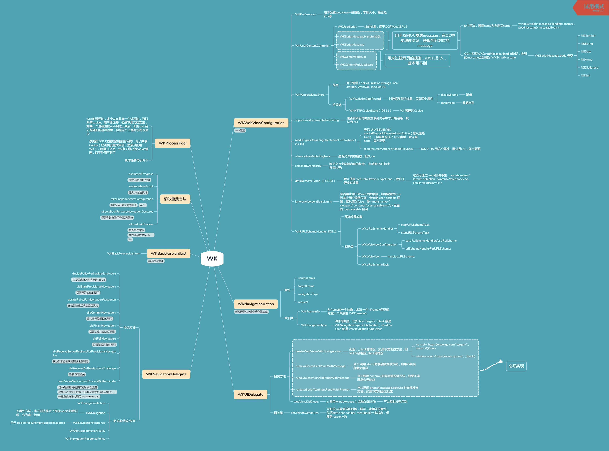
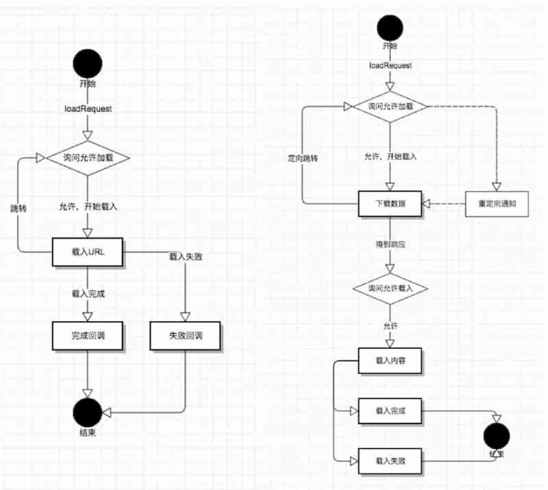

[[toc]]

[TOC]


# WK总结


## WK类分析

熟悉一个模块，先对内部所有类功能一个个熟悉，然后再跑个Demo各种验证功能，基本就差不多了。


### WKWebViewConfiguration

WKWeb页面的各种配置项，用config来创建WK，一旦创建wk后，就不能再修改config

#### WKPreferences

用于设置web view一些属性，字体大小、是否允许js等，作用不大

#### WKUserContentController

用与web页面进行JS通信和规则规律。该类主要由三个功能，向Web注入JS、与Web页面进行JS交互、按照设定的规则对Web页面进行过滤。**注意，网上有资料说 WKWebViewConfiguration 存在不被释放的问题，具体这块要再研究下**


##### WKUserScript

WKUserScript，JS的抽象，用于OC向Web注入或移除JS


##### 与JS交互

用于JS向OC发送message，在OC中实现该协议，获取到到对应的message

* WKScriptMessage

* WKScriptMessageHandler协议

  ```objc
  * js中写法，替换name为自定义name，window.webkit.messageHandlers.<name>.postMessage(<messageBody>)
  
  * OC中实现WKScriptMessageHandler协议，收到的message会封装为 WKScriptMessage
  
  ```


##### RuleList

用来过滤网页的规则，iOS11引入，基本用不到

* WKContentRuleList
* WKContentRuleListStore

相关资料：

* [iOS 11：WKWebView内容过滤规则详解](https://www.jianshu.com/p/8af24e9dc82e)

* [Creating a Content Blocker](https://developer.apple.com/documentation/safariservices/creating_a_content_blocker?language=objc)   官方文档，介绍了过滤的规则 

* [WWDC 17：customized_loading_in_wkwebview](https://developer.apple.com/videos/play/wwdc2017/220/)


#### WKWebsiteDataStore

用于管理 Cookies, session storage, local storage, WebSQL, IndexedDB等Web存储相关。

相关类有：

* WKWebsiteDataRecord，对数据类型的抽象，只有两个属性
  * displayName，键值
  * dataTypes，数据类型
* WKHTTPCookieStore，从iOS11开始引入，用于WK管理Cookie

#### suppressesIncrementalRendering

是否在所有的数据加载到内存中才开始渲染，默认为 NO，目前感觉作用不大。

#### mediaTypesRequiringUserActionForPlayback(iOS10)

类似 UIWEBVIEW的 mediaPlaybackRequiresUserAction（默认值是 true） ，但是修改成了 type类型，默认是none，即不需要。iOS 9- 10 用 **requiresUserActionForMediaPlayback** 属性，默认是NO，即不需要

#### allowsInlineMediaPlayback

是否允许内敛播放，默认NO

#### selectionGranularity

网页交互中选择内容的粒度。(自动变化/任何字符串边界)

#### dataDetectorTypes  （iOS10）

默认值是 WKDataDetectorTypeNone ，我们工程没有设置，这些可通过 meta自动添加 `<meta name="format-detection" content="telephone=no,email=no,adress=no">`

#### ignoresViewportScaleLimits

是否禁止用户对web页面缩放，如果设置为true则禁止用户缩放页面，会会略 user-scalable 设置；默认值为false，受 `<meta name="viewport" content="user-scalable=no"/>` 里面的 user-scalable 控制

#### WKURLSchemeHandler ( iOS11)

离线资源加载，只对对自定义的协议拦截，不能对http,https进行拦截

相关类：

* WKURLSchemeHandler
* WKWebViewConfiguration
* WKURLSchemeTask


### WKNavigationAction

对打开新web这个动作的抽象

#### 属性

* sourceFrame
* targetFrame
* navigationType
* request

#### 相关类

* **WKFrameInfo**，对frame的一个抽象，比如 一个<iframe>标签就对应一个单独的 WKFrameInfo
* **WKNavigationType**，动作的类型，比如 `<a href  target='_blank'>`就是WKNavigationTypeLinkActivated；`window.open` 就是 WKNavigationTypeOther


### WKUIDelegate

UI协议，用于处理 JS中 alert,confirm,prompt方法的展示，如果不实现相关协议，对应方法会无响应。注，在UIWebView中，这些是自动处理的。

#### 相关方法

* `createWebViewWithConfiguration`，处理 \_blank的情况，如果不实现该方法，则WK不会响应\_blank的情况

  ```js
  // 针对以下两种 _blank的情况，如果不实现该方法，以下两种行为会失效，即不会加载新页面
  <a href="https://www.qq.com" target="_blank">QQ</a>
  window.open ('https://www.qq.com', '_blank')
  ```

* `runJavaScriptAlertPanelWithMessage`，当JS 调用 alert()时候会触发该方法，如果不实现则会无响应

* `runJavaScriptConfirmPanelWithMessage`，当JS调用 confirm()时候会触发该方法，如果不实现则会无响应

* `runJavaScriptTextInputPanelWithPrompt`，当JS调用 prompt(message,default) 时会触发该方法，如果不实现会无反应

* `webViewDidClose:`，JS 调用 `window.close ();` 会触发该方法

#### 相关类

* WKWindowFeatures，当新的wk被请求的时候，展示一些额外的属性，包括statusbar, toolbar, menubar的一些状态，但都是readonly的


### WKNavigationDelegate

一个非常重要的协议，webview加载各个阶段的代理方法。

#### 协议方法

* `decidePolicyForNavigationAction`，在发送请求之前决定是否跳转

* `didStartProvisionalNavigation`，页面开始加载时调用

* `decidePolicyForNavigationResponse`，在收到响应后决定是否跳转

* `didCommitNavigation`，当内容开始返回时调用

* `didFinishNavigation`，页面加载完成之后调用

* `didFailNavigation`，启动时加载数据发生错误就会调用这个方法

* `didFailProvisionalNavigation:withError:`，当一个正在提交的页面在跳转过程中出现错误时调用这个方法

* `didReceiveServerRedirectForProvisionalNavigation`，接收到服务器跳转请求之后调用

* `didReceiveAuthenticationChallenge`，证书 认证相关

* `webViewWebContentProcessDidTerminate`，当wk进程即将被杀死的时候会调用，比如内存过高的时候，但是有文章说也有部分情况不会调用。一般在此方法内调用 webview reload

#### 相关类/协议/枚举

* **WKNavigationAction**
* **WKNavigation**，无属性方法，官方说法是为了跟踪web的加载过程，作为唯一标示
* **WKNavigationResponse**，用于 decidePolicyForNavigationResponse
* **WKNavigationActionPolicy**
* **WKNavigationResponsePolicy**


### WKBackForwardList

用于页面前进后退管理，比较简单

#### 相关类

* WKBackForwardListItem


### WKProcessPool

web的进程池，多个web共享一个进程池，可以共享cookie、用户凭证等，但是苹果文档支出，如果一个进程池的web到达上限后，新的web会分配到新的进程池里，但是这个上限并没有说多少。

该类在iOS11之前应该是很有用的，为了共享Cookie（把该类设置成单例，然后分配给WK），但是11之后，wk有了自己的cookie管理，似乎作用不到了。

具体还要再研究下


### 部分重要方法

* **estimatedProgress**，页面加载进度，可以KVO
* **evaluateJavaScript**，可以向页面注入JS方法执行
* **takeSnapshotWithConfiguration**，获取wk可见区域的视图，iOS11引入
* **allowsBackForwardNavigationGestures**，是否允许右滑手势，默认是NO。设置为YES后，右滑会打开上个Web页面，体验与Native类似
* **allowsLinkPreview**，是否允许预览,10及其以后默认值是YES之前是NO，如果设置YES,用户点击会跳转到Safari


## 类结构图



## 工程实践注意点

### WKScriptMessageHandler协议

```objc

//苹果在 WKWebView 中的 js runtime 里事先注入了一个 window.webkit.messageHandlers.OOXX.postMessage() 方法，我们可以使用这个方法直接向 Native 层传值，异常方便

    
//Demo：
    JS:
在JS中使用window.webkit.messageHandlers.TEST.postMessage()向APP传值

    OC:
func userContentController(userContentController: WKUserContentController, didReceiveScriptMessage message: WKScriptMessage) {
//根据定义的key来判断message
    if message.name == "TEST" {
    //转换为字典,并获取key/value
        if let dic = message.body as? NSDictionary,
          
        }
    }
}
```


### _blank情况

JS中使用_blank打开新页面的情况有两种：

- `<a href="https://www.qq.com" target="_blank">QQ</a>`
- `window.open ('https://www.qq.com', '_blank’)`

当以上两种情况使用 _blank 需要新开页面的情况，如果WK不实现相关代理方法，则WK会无响应。

```objc
//示例代码

#pragma mark - WKUIDelegate
/*
 处理：_blank的情况，如果不实现该方法，则WK不会响应_blank的情况
 <a href="https://www.qq.com" target="_blank">QQ</a>   ，对应 WKNavigationAction.navigationType == WKNavigationTypeLinkActivated
 window.open ('https://www.qq.com', '_blank');  对应 WKNavigationAction.navigationType == WKNavigationTypeOther
 */
- (nullable WKWebView *)webView:(WKWebView *)webView createWebViewWithConfiguration:(WKWebViewConfiguration *)configuration forNavigationAction:(WKNavigationAction *)navigationAction windowFeatures:(WKWindowFeatures *)windowFeatures{
    //对于加载新连接的情况是 navigationAction.sourceFrame = xxxx, navigationAction.targetFrame = nil
    if (!navigationAction.targetFrame.isMainFrame) {        //感觉这里判断的意义不大，测试了 href, window.open, iframe 里面的href 和 open, 对应的 target 都为 nil，且该方法只会走一次，已知的两种情况targetFrame都为nil ，u不知道有没其他情况
        [webView loadRequest:navigationAction.request];
    }
    return nil;
}

```


网上还有一种方案是说，用 WKNavigationDelegate 的 decidePolicyForNavigationAction，该方法是当加载任一url的时候都会加载 ，**但是这个方法只有 href 的情况调用，当Js调用 windows.open 的时候 不会调用**：

```objc
#pragma mark - WKNavigationDelegate

/*
 
 这个方法是加载任意url都会先走这个方法，
 <a href="" target="_blank> 的情况会走该方法，
 windown.open(url,'_blank")则不会先走，如果不实现 createWebViewWithConfiguration ，则会无响应
 
 第一打开web
 navigationAction.sourceFrame = nil
 navigationAction.targetFrame = xxxxx
 
 加载其他链接
 navigationAction.sourceFrame = xxxxx
 navigationAction.targetFrame = nil
 
 navigationAction.sourceFrame = nil
 navigationAction.targetFrame = yyyyy
 
 
 */
- (void)webView:(WKWebView *)webView decidePolicyForNavigationAction:(WKNavigationAction *)navigationAction decisionHandler:(void (^)(WKNavigationActionPolicy))decisionHandler{
    //如果是跳转一个新页面
    if (navigationAction.targetFrame == nil) {
        [webView loadRequest:navigationAction.request];
    }
    decisionHandler(WKNavigationActionPolicyAllow);
}

```


### WK 在alert 无法弹出时会出现 Crash 

详见 [WKWebView 那些坑    Bugly](https://mp.weixin.qq.com/s/rhYKLIbXOsUJC_n6dt9UfA)  


### WKUIDelegate

WKUIDelegate 的几个回调需要处理，否则 JS的 *alert()*、*confirm()*、*prompt(message,default)* 方法会无响应。

其中 `webViewDidClose:`可以不用处理，该回调对应 js 的 *window.close ()*方法。 目前似乎没有这个场景，window.close()是针对使用 window.open() 打开的页面，目前这种写法比较少。


```objective-c

#pragma mark - WKUIDelegate


/*
 处理：_blank的情况，如果不实现该方法，则WK不会响应_blank的情况
 <a href="https://www.qq.com" target="_blank">QQ</a>   ，对应 WKNavigationAction.navigationType == WKNavigationTypeLinkActivated
 window.open ('https://www.qq.com', '_blank');  对应 WKNavigationAction.navigationType == WKNavigationTypeOther
 */
- (nullable WKWebView *)webView:(WKWebView *)webView createWebViewWithConfiguration:(WKWebViewConfiguration *)configuration forNavigationAction:(WKNavigationAction *)navigationAction windowFeatures:(WKWindowFeatures *)windowFeatures{
    //对于加载新连接的情况是 navigationAction.sourceFrame = xxxx, navigationAction.targetFrame = nil
    if (!navigationAction.targetFrame.isMainFrame) {        //感觉这里判断的意义不大，测试了 href, window.open, iframe 里面的href 和 open, 对应的 target 都为 nil，且该方法只会走一次，已知的两种情况targetFrame都为nil ，不知道有没其他情况
        [webView loadRequest:navigationAction.request];
    }
    return nil;
}

/*
 js 调用 window.close (); 会触发该方法，官方文档说：
 Your app should remove the web view from the view hierarchy and update the UI as needed, for instance by closing the containing browser tab or window.
 但是目前似乎没有这个场景，window.close()是针对使用 window.open() 打开的页面，似乎 这种写法比较少
 该代理暂时不处理
 
 */
//- (void)webViewDidClose:(WKWebView *)webView API_AVAILABLE(macosx(10.11), ios(9.0)){
//
//}

//当JS 调用 alert()时候会触发该方法，如果不实现则会无响应
- (void)webView:(WKWebView *)webView runJavaScriptAlertPanelWithMessage:(NSString *)message initiatedByFrame:(WKFrameInfo *)frame completionHandler:(void (^)(void))completionHandler{
    
    UIAlertController *alert = [UIAlertController alertControllerWithTitle:message
                                                                   message:nil
                                                            preferredStyle:UIAlertControllerStyleAlert];
    UIAlertAction *action = [UIAlertAction actionWithTitle:@"确定"
                                                     style:UIAlertActionStyleDefault
                                                   handler:^(UIAlertAction * _Nonnull action) {
                                                       completionHandler();
                                                   }];
    [alert addAction:action];
    [self.currentVC presentViewController:alert animated:YES completion:nil];
}

//当JS调用 confirm()时候会触发该方法，如果不实现则会无响应
- (void)webView:(WKWebView *)webView runJavaScriptConfirmPanelWithMessage:(NSString *)message initiatedByFrame:(WKFrameInfo *)frame completionHandler:(void (^)(BOOL result))completionHandler{
    UIAlertController *alert = [UIAlertController alertControllerWithTitle:message
                                                                   message:nil
                                                            preferredStyle:UIAlertControllerStyleAlert];
    UIAlertAction *sure = [UIAlertAction actionWithTitle:@"确定"
                                                   style:UIAlertActionStyleDefault
                                                 handler:^(UIAlertAction * _Nonnull action) {
                                                     completionHandler(YES);
                                                 }];
    UIAlertAction *cacle = [UIAlertAction actionWithTitle:@"取消"
                                                    style:UIAlertActionStyleCancel
                                                  handler:^(UIAlertAction * _Nonnull action) {
                                                      completionHandler(NO);
                                                  }];
    
    [alert addAction:sure];
    [alert addAction:cacle];
    [self.currentVC presentViewController:alert animated:YES completion:nil];
}

/*
 当JS调用 prompt(message,default) 时会触发该方法，如果不实现会无反应，注意 defaultd参数无textfiled的默认值不是placeHolder
 注意点，在action的handler里是不能直接饮用 UIAlertController 的，否则会造成循环引用。网上的例子多是直接引用，是不对的
 */
- (void)webView:(WKWebView *)webView runJavaScriptTextInputPanelWithPrompt:(NSString *)prompt defaultText:(nullable NSString *)defaultText initiatedByFrame:(WKFrameInfo *)frame completionHandler:(void (^)(NSString * _Nullable result))completionHandler{
    UIAlertController *alert = [UIAlertController alertControllerWithTitle:prompt
                                                                   message:nil
                                                            preferredStyle:UIAlertControllerStyleAlert];
    
    __weak typeof(alert) weakAlert = alert;
    UIAlertAction *sure = [UIAlertAction actionWithTitle:@"确定"
                                                   style:UIAlertActionStyleDefault
                                                 handler:^(UIAlertAction * _Nonnull action) {
                                                     //                                                       网上例子大多是直接饮用alert，这里直接引用alert是会造成 UIAlertController 泄露的，理论实践都验证了
                                                     //                                                     completionHandler(alert.textFields.firstObject.text);
                                                     completionHandler(weakAlert.textFields.firstObject.text);
                                                 }];
    UIAlertAction *cacle = [UIAlertAction actionWithTitle:@"取消"
                                                    style:UIAlertActionStyleCancel
                                                  handler:^(UIAlertAction * _Nonnull action) {
                                                      completionHandler(nil);
                                                  }];
    [alert addTextFieldWithConfigurationHandler:^(UITextField * _Nonnull textField) {
        textField.text = defaultText;
    }];
    
    [alert addAction:sure];
    [alert addAction:cacle];
    [self.currentVC presentViewController:alert animated:YES completion:nil];
}

```


### WKNavigationDelegate

#### 调用顺序分析

不存在iframe时的web调用顺序

```objc
//不存在iframe时的调用顺序
webView:decidePolicyForNavigationAction:decisionHandler:
webView:didStartProvisionalNavigation:
webView:decidePolicyForNavigationResponse:decisionHandler:
ebView:didCommitNavigation:
webView:didFinishNavigation:

```


当页面存在一个iframe标签时调用顺序为

```objc
//当页面存在一个iframe时调用顺序为：
webView:decidePolicyForNavigationAction:decisionHandler:    （URL:http://192.168.1.100:8005/）
webView:didStartProvisionalNavigation:
webView:decidePolicyForNavigationResponse:decisionHandler:
webView:didCommitNavigation:

//这里会多出这两次调用，用于加载iframe
webView:decidePolicyForNavigationAction:decisionHandler:    （URL:http://192.168.1.100:8005/sencond.html）
webView:decidePolicyForNavigationResponse:decisionHandler:

webView:didFinishNavigation:

```


当有两个 iframe时的调用顺序，即对iframe会一次性调用 `decidePolicyForNavigationAction` ，然后再一次性调用`decidePolicyForNavigationResponse`

```objc

//当有两个 iframe时的调用顺序，即对iframe会一次性调用 decidePolicyForNavigationAction ，然后再一次性调用decidePolicyForNavigationResponse
webView:decidePolicyForNavigationAction:decisionHandler:  url:http://192.168.1.100:8005/
webView:didStartProvisionalNavigation:
webView:decidePolicyForNavigationResponse:decisionHandler:  url:http://192.168.1.100:8005/
webView:didCommitNavigation:

webView:decidePolicyForNavigationAction:decisionHandler:  url:http://192.168.1.100:8005/sencond.html
webView:decidePolicyForNavigationAction:decisionHandler:  url:http://192.168.1.100:8005/thrid.html
webView:decidePolicyForNavigationResponse:decisionHandler:  url:http://192.168.1.100:8005/sencond.html
webView:decidePolicyForNavigationResponse:decisionHandler:  url:http://192.168.1.100:8005/thrid.html

webView:didFinishNavigation:

```


如果在 decidePolicyForNavigationAction 中选择cancel，调用顺序

```objc
//如果在 decidePolicyForNavigationAction 中选择cancel，调用顺序
webView:decidePolicyForNavigationAction:decisionHandler:

```


如果在 decidePolicyForNavigationResponse 里选择 cancel的调用顺序，最后会调用fail

```objc
//如果在 decidePolicyForNavigationResponse 里选择 cancel的调用顺序，最后会调用fail
webView:decidePolicyForNavigationAction:decisionHandler:
webView:didStartProvisionalNavigation:
webView:decidePolicyForNavigationResponse:decisionHandler:
webView:didFailProvisionalNavigation:withError:

```


#### 关于错误回调

WK错误回调有两个：

* `webView:didFailProvisionalNavigation:withError:` ，启动时加载数据发生错误就会调用这个方法 

* `webView:didFailNavigation:withError:`，当一个正在提交的页面在跳转过程中出现错误时调用这个方法 ，例如在didCommitNavigation这个代理方法中调用webview的stopLoading方法，但是具体还有点不清楚

具体区别还没搞清楚，现在测试如果页面加载失败，比如关掉nginx的情况，会调用 didFailProvisionalNavigation

```objc
webView:decidePolicyForNavigationAction:decisionHandler:  url:http://192.168.1.110/
webView:didStartProvisionalNavigation:
webView:didFailProvisionalNavigation:withError:
```


#### UIWebView/WKWebView 加载流程对比

WK的回调更加细分，方便精细度控制




### UserAgent

WK新增了两种设置UA的方法

* `WKWebViewConfiguration.applicationNameForUserAgent`，这个会对默认的UA值设备信息部分进行替换
* `WKWebView.customUserAgent`，设置这个值会完全覆盖UA值

示例

```objc
//WK
Defaults User-Agent: 
Mozilla/5.0 (iPhone; CPU iPhone OS 12_4 like Mac OS X) AppleWebKit/605.1.15 (KHTML, like Gecko) Mobile/15E148

WKWebViewConfiguration.applicationNameForUserAgent:    TestUA
Mozilla/5.0 (iPhone; CPU iPhone OS 12_4 like Mac OS X) AppleWebKit/605.1.15 (KHTML, like Gecko) TestUA

WKWebView.customUserAgent:    TestUA
User-Agent: TestUA

```


设置全局UA方法：

```objc
WKWebView  *wkWebView = [[WKWebView alloc] initWithFrame:CGRectZero];
[self.wkWebView evaluateJavaScript:@"navigator.userAgent" completionHandler:^(id  _nullable result, NSError * _nullable error) {      
   //1）获取默认userAgent：
   NSString *oldUA = result;   //直接获取为nil 
  
  //2）设置userAgent：添加额外的信息   
  NSString *newUA = [NSString stringWithFormat:@"%@ crfapp/(%@)", oldUA , @"ios;43"];    
  NSDictionary *dictNU = [NSDictionary dictionaryWithObjectsAndKeys:newUA, @"UserAgent", nil];   
  [[NSUserDefaults standardUserDefaults] registerDefaults:dictNU];
}];

//注：WKWebView  调用evaluateJavaScript方法获取UA或者设置UA时，需执行loadRequest方法，否则completionHandler result值为空。但是经过测试，是可以拿到的，估计部分系统有该问题

NSURL *url = [NSURL URLWithString:"h5Url"];
NSURLRequest *request = [NSURLRequest requestWithURL:url
                                             cachePolicy:NSURLRequestUseProtocolCachePolicy
                                         timeoutInterval:10.f];
[self.wkWebView loadRequest:request];

```


经过测试，**UA的优先级为：WKWebView.customUserAgent > 全局设置 > applicationNameForUserAgent**

**注意，WK全局设置UA，由于是异步，回调可能比较晚，App启动第一次可能回调还没回来，所以UA可能会失效。可直接使用UIWebView设置UA，并设置WK的 applicationNameForUserAgent或customUserAgent，用来防止UA失去自定义节点。**


### 本地离线包加载

#### loadRequest

真机不能使用loadRequest，无法加载本地页面，但是模拟器可以


#### **loadFileURL:allowingReadAccessToURL:**

NSURL 必须是file协议，否则会无法加载

使用 `NSURL *url = [NSURL fileURLWithPath:fragment]` 方法会对#等参数进行编码，导致无法识别。所以有两种解决方法：

1. 手动拼接 `file://`，不使用 `fileURLWithPath:`方法

2. 使用 NSURLComponents方法，对query和fragmetn进行设置

   ```objective-c
   
               NSURLComponents *test = [NSURLComponents componentsWithURL:url resolvingAgainstBaseURL:nil];
               test.fragment = @"/list";
               [test setQueryItems:@[[NSURLQueryItem queryItemWithName:@"data" value:@"3333"]]];
               [self.webView loadFileURL:test.URL allowingReadAccessToURL:[NSURL fileURLWithPath:document]];
   
   
   ```


#### 设置WK跨域

另外需要注意，必须设置WK跨域，否则会无法加载本地包

```objective-c
    [configuration.preferences setValue:@YES forKey:@"allowFileAccessFromFileURLs"];
    if (@available(iOS 10.0, *)) {
        [configuration setValue:@YES forKey:@"allowUniversalAccessFromFileURLs"];
    }
}
```


###拦截WKWebView请求


#### 私有API拦截WK请求

基于UIWebView可以自由做拦截，然后做资源缓存等处理，但是WK无法通过 NSURLProtocol 做拦截，资源缓存这块比较难处理。


WK的请求其实是可以拦截的，通过一个私有API `[WKBrowsingContextController registerSchemeForCustomProtocol:]`，但是这种方案有两个问题：

* Web页面的POST请求body体会被清空
* 对ATS支持不足，Allow Arbitrary Loads 选项设置为NO 下，一旦拦截后，WK发起的http网络请求会被阻塞。不过这块设置为YES即可。


针对第一个问题，其实网上有一个方案可以绕过，大致思路是：

1. Hook Ajax请求，Web页面的Ajax请求全部通过Native转发
2. 通过私有API拦截WK请求，由于Ajax请求已经被Hook，剩下的请求一般都是图片等资源请求，不存在body体的情况，可以拦截后做本地缓存等处理。

不过需要注意点，目前似乎只能做到Hook Ajax请求，还无法做到Hook fetch请求。如果Web页面有post的fetch请求，请求会失败。还有文章提出Hook Ajax可能存在 **post header字符长度限制** 、**Put类型请求异常**等情况。

具体可参考：

* [Ajax-hook](https://github.com/wendux/Ajax-hook)

* [KKJSBridge](https://github.com/karosLi/KKJSBridge)


还有一个技巧，可通过搭建locak web server的形式来加载本地包，不过个人感觉这块目前意义不大，具体可参考 [基于 LocalWebServer 实现 WKWebView 离线资源加载](https://juejin.im/entry/599e500e6fb9a0249174fa31)


#### WKURLSchemeHandler

作用与NSURLProtocol类似，可以拦截网络请求，但是只能拦截WK中自定义协议，一般使用 WKURLSchemeHandler 实现的 WKWebView 离线资源加载。**WKURLSchemeHandler 最好的场景还是用在加载本地图片上，其它方面不稳定，慎用**。 

WKURLSchemeHandler 是 iOS11 就推出的，用于处理自定义请求的方案，不过并不能处理 HTTP、HTTPS 等常规 scheme。 

```objc
//相关代码

//WKURLSchemeHandler
- (void)webView:(WKWebView *)webView startURLSchemeTask:(id <WKURLSchemeTask>)urlSchemeTask;
- (void)webView:(WKWebView *)webView stopURLSchemeTask:(id <WKURLSchemeTask>)urlSchemeTask;

//WKWebViewConfiguration
//注册 schemeHandle， You can use +[WKWebView handlesURLScheme:] to check the availability of a given URL scheme.
- (void)setURLSchemeHandler:(nullable id <WKURLSchemeHandler>)urlSchemeHandler forURLScheme:(NSString *)urlScheme API_AVAILABLE(macosx(10.13), ios(11.0));
//获取当前 schemeHandle 示例
- (nullable id <WKURLSchemeHandler>)urlSchemeHandlerForURLScheme:(NSString *)urlScheme API_AVAILABLE(macosx(10.13), ios(11.0));


//WKWebView
//判断  urlScheme 是否可以用
+ (BOOL)handlesURLScheme:(NSString *)urlScheme API_AVAILABLE(macosx(10.13), ios(11.0));


//WKURLSchemeTask
@property (nonatomic, readonly, copy) NSURLRequest *request;
- (void)didReceiveResponse:(NSURLResponse *)response;
- (void)didReceiveData:(NSData *)data;
- (void)didFinish;
- (void)didFailWithError:(NSError *)error;

```


参考资料：

- [WKURLSchemeHandler 的能与不能](https://mp.weixin.qq.com/s/VcvZ1C1Qs26v5iB8dwBjcw)
- [AppHost](https://github.com/hite/AppHost)   一个 native 和 h5 通讯的框架，支持调试 
- [WWDC 2017 Customized Loading in WKWebView](https://developer.apple.com/videos/play/wwdc2017/220/)
- [思考 NSURLProtocol 无法拦截 WKWebview 请求的解决思路](https://blog.csdn.net/pengyuan_D/article/details/89958936) ，在本篇文章中，使用了私有api，hook wk，从而拦截http, https请求，（不过 iOS 12.2 上该方法已经失效，不存在此属性，详见 [iOS 设置代理（Proxy）方案总结](https://nemocdz.github.io/post/ios-%E8%AE%BE%E7%BD%AE%E4%BB%A3%E7%90%86proxy%E6%96%B9%E6%A1%88%E6%80%BB%E7%BB%93/) 


### Cookie问题

WK的软肋之一就是Cookie问题，**Cookie问题的核心就是 WKWebview 与 NSHTTPCookieStorage 的Cookie不共享**。

WK在 iOS11 推出了 WKHTTPCookieStore 管理Cookie，基本解决了Cookie软肋的问题。不过依然无法做到与Native请求共享Cookie，如果共享需要手动处理。


鉴于工程实际情况，对WK的Cooike做了以下处理：

* 创建一个 WKProcessPool 的单例，WK共享该 WKProcessPool，使不同WK共享WK

* 对iOS11 以下的情况，针对首次request主动携带 NSHTTPCookieStorage 里的Cookie

  ```objective-c
  NSArray<NSHTTPCookie *> *availableCookie = [[NSHTTPCookieStorage sharedHTTPCookieStorage] cookiesForURL:request.URL];
                      if (availableCookie.count > 0) {
                          NSDictionary *reqHeader = [NSHTTPCookie requestHeaderFieldsWithCookies:availableCookie];
                          NSString *cookieStr = [reqHeader objectForKey:@"Cookie"];
                          
                          muRequest = [request mutableCopy];
                          [(NSMutableURLRequest *)muRequest setValue:cookieStr forHTTPHeaderField:@"Cookie"];
                      }
  [webView loadRequest:muRequest];
  ```

* 其他情况，无业务需求，暂不做处理。Cookie这块比较复杂，看的脑壳疼，目前基于工程现状，不需要做到

NSHTTPCookieStorage 与 WK的同步，具体有需要再处理。


不同工程注意点不一样，这块具体可以参考

[WKWebView 你爬出来了吗？](https://xiaozhuanlan.com/topic/5743162890)

[WKWebView Cookie 问题](https://www.geniusqyu.com/2018/12/02/WKWebView-cookie-%E9%97%AE%E9%A2%98/)

[教你使用 WKWebView 的正确姿势](https://juejin.im/entry/5975916e518825594d23d777)

[WKWebView 那些坑    Bugly](https://mp.weixin.qq.com/s/rhYKLIbXOsUJC_n6dt9UfA)

[iOS中UIWebView与WKWebView、JavaScript与OC交互、Cookie管理看我就够（上）](https://www.jianshu.com/p/ac45d99cf912)

[iOS中UIWebView与WKWebView、JavaScript与OC交互、Cookie管理看我就够（中）](https://www.jianshu.com/p/870dba42ec15)

[iOS中UIWebView与WKWebView、JavaScript与OC交互、Cookie管理看我就够（下）](https://www.jianshu.com/p/52668d5b2e68)

[一站式解决WKWebView各类问题](https://mp.weixin.qq.com/s?__biz=MzA5NzMwODI0MA==&mid=2647764511&idx=1&sn=eb792ed468a13239926641c9dd7091e2&chksm=8887d520bff05c36484ed8a9a0731014c93a94ac0d7d9f944c9470cad48d1f21ec0dccc552a7&mpshare=1&scene=1&srcid=&sharer_sharetime=1567467597976&sharer_shareid=c38ca2f3cbd21853ce550074313749fc%23rd)


### 白屏问题

在 [WKWebView 那些坑    Bugly](https://mp.weixin.qq.com/s/rhYKLIbXOsUJC_n6dt9UfA) 中有提到白屏问题，WK是独立的进程，当系统内存过高时，可能会Kill掉WK进程，造成白屏问题。文中的做法是在 `webViewWebContentProcessDidTerminate:` 回调中执行 `reload`。

在接入实际过程中，发现我们工程中简单的执行reload会有以下几个问题：

* 页面非当前展示页面时，即使调用reload，系统依然会再次kill掉页面，会造成频繁kill，频繁reload，消耗性能
* file协议的本地Web页面，执行reload会报错：`  *Error Domain=kCFErrorDomainCFNetwork Code=1 "(null)" UserInfo={_NSURLErrorFailingURLSessionTaskErrorKey=LocalDataTask* `


#### Web页面URL远程和本地

1. http/https，http类型的可以执行 `reload`
2. file（即本地包），file协议的必须要执行 `loadFileURL:allowingReadAccessToURL:` 才能正常加载。这里需要注意，如果WK正常展示过程中调用 `reload`是可以正常刷新的。但是在 `webViewWebContentProcessDidTerminate:` 函数中调用`reload`会报错，即被Terminated后，必须调用  `loadFileURL:allowingReadAccessToURL:` 重新加载


#### Web页面被Kill时的两种情况

##### Web页面正在展示

这种情况，直接`reload`（file协议需要调用`loadFileURL:allowingReadAccessToURL:`，后面类似情况都需要做区分，不再赘述）


##### Web页面非当前展示页面，退到后台或在导航栈中非当前展示的VC中

这种情况不建议直接刷新页面，系统Kill是为了减少内存，如果直接刷新，经过测试系统还会继续Kill。所以直接刷新意义不大，只会造成频繁的Kill和刷新，消耗性能。

另外，在我们工程中，是混合Bridge模式，比如 `A混合页面 -> B混合页面 -> C混合页面` ，A需要隐藏bar ,B C 需要展示bar ,此时如果A被杀死 然后直接reload，A中的Bridge会造成bar 被隐藏，BC页面的显示就会有问题。

因此这种情况需要监听 **前后台状态和viewWillAppear/Disappear** ，在 `webViewWebContentProcessDidTerminate:`  中记录当前URL，当页面重新展示时（从后台到前台或触发viewWillAppear）再重新刷新页面。**不过需要注意，这种情况下会有个短暂的loading或白屏。**


### estimatedProgress问题

estimatedProgress 是WK推出用于监听页面加载进度的。**需要注意的是，estimatedProgress 并不是从`loadRequst`开始，也不一定是从 `decidePolicyForNavigationAction:`或 `didStartProvisionalNavigation`开始。**即中间会有一段白屏期，这块需要注意下，不过目前测试下来，这个时间目前还可以接受，暂时没有处理。

具体可参考 [WKWebview 加载过程中的性能指标图解](https://mp.weixin.qq.com/s/XNv_3yyk-vH1xOMtPZ4K-A)


### 默认的跳转行为，打开 iTuns、tel、mail、等其他scheme

WK上打开 mailto、tel、facetime、sms和其他scheme时，默认会忽略这些链接，不会有任何反应，这块需要单独处理。在 `decidePolicyForNavigationAction:`中判断scheme，然后调用`openURL: `函数打开。

```

//参考代码
- (void)webView:(WKWebView *)webView decidePolicyForNavigationAction:(WKNavigationAction *)navigationAction decisionHandler:(void (^)(WKNavigationActionPolicy))decisionHandler{
    
    NSURL *tmpURL = navigationAction.request.URL;
    NSArray *schemes = @[@"http",@"https",@"file",@"about"];        //注意这类需要加about，部分空连接 scheme 是 about
    if (![schemes containsObject:tmpURL.scheme]) {
        if (@available(iOS 10.0,*)) {
            [[UIApplication sharedApplication] openURL:tmpURL
                                               options:@{}
                                     completionHandler:nil];
        }else{
            [[UIApplication sharedApplication] openURL:tmpURL];
        }
        decisionHandler(WKNavigationActionPolicyCancel);
        return;
    }
}
```


## 附录

[WebKit](https://developer.apple.com/documentation/webkit?language=objc)

[Safari Developer Help](https://support.apple.com/zh-cn/guide/safari-developer/welcome/mac)   Safari调试工具 

[WKWebView](https://developer.apple.com/documentation/webkit/wkwebview?language=objc)

[WKWebView学习笔记](https://www.jianshu.com/p/7bb5f15f1daa)

[IOS进阶之WKWebView](https://www.jianshu.com/p/4fa8c4eb1316)

[WKWebview的使用及遇到的问题](https://ongfei.github.io/2016/05/14/WKWebview%E7%9A%84%E4%BD%BF%E7%94%A8%E5%8F%8A%E9%81%87%E5%88%B0%E7%9A%84%E9%97%AE%E9%A2%98/)

[移动端本地 H5 秒开方案探索与实现](https://mp.weixin.qq.com/s/0OR4HJQSDq7nEFUAaX1x5A)

[WebView性能、体验分析与优化](https://tech.meituan.com/2017/06/09/webviewperf.html)

[让 WKWebView 支持 NSURLProtocol](https://blog.moecoder.com/2016/10/26/support-nsurlprotocol-in-wkwebview/)

[wkwebkit-nshipster](https://nshipster.cn/wkwebkit/)

[WKWebView 你爬出来了吗？](https://xiaozhuanlan.com/topic/5743162890)

[WKWebView Cookie 问题](https://www.geniusqyu.com/2018/12/02/WKWebView-cookie-%E9%97%AE%E9%A2%98/)

[iOS 防 DNS 污染方案调研（四）--- Cookie 业务场景](https://github.com/ChenYilong/iOSBlog/issues/14)

[教你使用 WKWebView 的正确姿势](https://juejin.im/entry/5975916e518825594d23d777)

[WKWebView 那些坑    Bugly](https://mp.weixin.qq.com/s/rhYKLIbXOsUJC_n6dt9UfA)

[iOS中UIWebView与WKWebView、JavaScript与OC交互、Cookie管理看我就够（上）](https://www.jianshu.com/p/ac45d99cf912)

[iOS中UIWebView与WKWebView、JavaScript与OC交互、Cookie管理看我就够（中）](https://www.jianshu.com/p/870dba42ec15)

[iOS中UIWebView与WKWebView、JavaScript与OC交互、Cookie管理看我就够（下）](https://www.jianshu.com/p/52668d5b2e68)

[一站式解决WKWebView各类问题](https://mp.weixin.qq.com/s?__biz=MzA5NzMwODI0MA==&mid=2647764511&idx=1&sn=eb792ed468a13239926641c9dd7091e2&chksm=8887d520bff05c36484ed8a9a0731014c93a94ac0d7d9f944c9470cad48d1f21ec0dccc552a7&mpshare=1&scene=1&srcid=&sharer_sharetime=1567467597976&sharer_shareid=c38ca2f3cbd21853ce550074313749fc%23rd)

[WKWebView 的接口中文文档](https://blog.yincode.com/2018/03/23/WKWebView%E5%BC%80%E5%8F%91%E8%BF%87%E7%A8%8B%E9%97%AE%E9%A2%98%E9%9B%86%E5%90%88/)