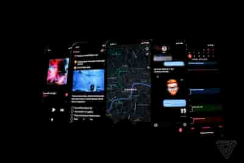
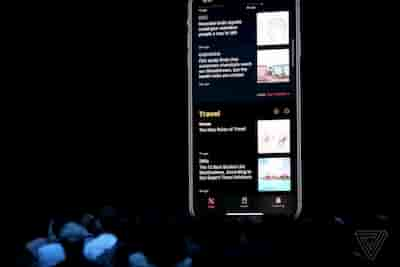
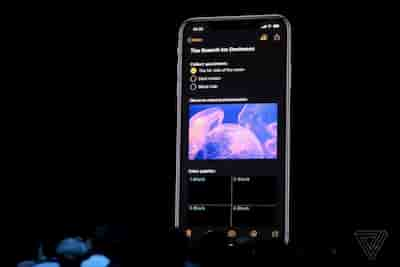
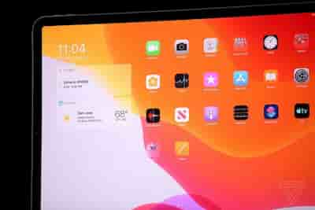
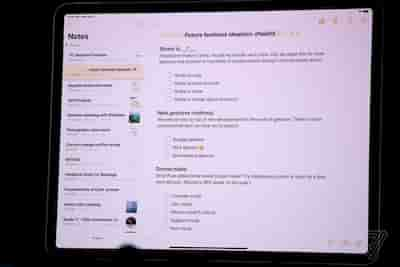
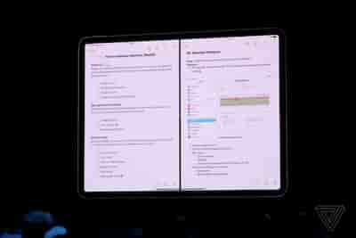
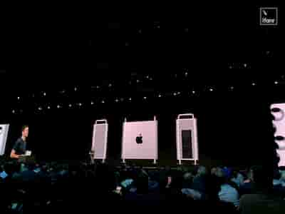
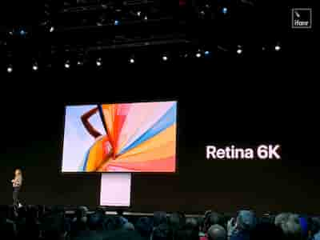
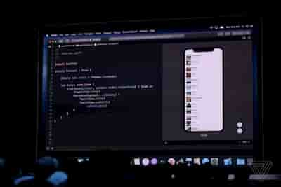

[TOC]
[[toc]]

# WWDC19 概要

## tvOS

* Apple TV 用户将迎来大量原创剧集更新,提供4K极致画质。
* tvOS 引入了功能强大的控制中心 UI 。Up Next列表为家中的每个人定制了各种节目。竟然还支持游戏手柄了，包括微软Xbox One 和索尼 PlayStation 手柄。

## watchOS 6

* 支持噪音检测
* 独立运行计算器、音频书籍和语音备忘录
* App Store将推出Apple Watch应用专区，让app直接从Watch安装。

## iOS13

* iOS12 实现了85%的安装量

* iOS13 Face ID识别解锁速度将提升30%

* iOS13应用打包方式会发生变化，安装包大小减少一半，更新包减少 60%，应用启动速度会提升 60%

* iOS 13将推出Dark模式

* Safari加入了网页预配置，邮件得到了全新的桌面格式和新字体，笔记本能够共享文件夹。

* Apple Music也终于迎来了随着时间滚动的歌词功能，滑动输入法的正式名为Quick Path

* 苹果地图改进，街景滚动更加流畅。前进视角顺畅无比

* 推出 Sign In with Apple ，使用苹果账号登录应用。这点需要注意下，从最近更新的苹果应用商店审核指南中  [Updates to the App Store Review Guidelines](https://developer.apple.com/news/?id=06032019j) ，苹果要求有接入第三方登录App必须接入苹果账号登录，否则可能审核会不通过

  > Sign In with Apple will be available for beta testing this summer. It will be required as an option for users in apps that support third-party sign-in when it is commercially available later this year.

* 隐私方面继续加强，第三方 App 无法通过 Wi-Fi 或蓝牙来猜测用户的位置。苹果为用户提供了隐私邮件地址
* HomeKit更新，HomeKit Secure Video是一整套分析安防视频的云服务该服务能够在本地分析监控视频，然后加密并上传至iCloud，提供十天免费 iCloud 云端存储（不占用账户剩余容量）
* Memoji更新，支持更加个性化的装扮特性。
* 相机更新，增加全新的人像打光模式
* Photos 更新，相册依然支持捏拉缩放，另有滑块可提示年份、月份、日期。视频也同样迎来了编辑调节界面更新，你现在可以直接翻转一个视频，浏览窗口可以直接播放视频和 Live Photos 。
* HomePod支持更加个性化的体验，Siri支持 iHeartRadio, TuneIn等10万以上在线电台。HomePod将支持Handoff功能，将iPhone靠近HomePod，后者就会接棒播放音乐。
* CarPlay 仪表板将迎来重大更新

### Dark模式

## iPadOS

* iPad将迎来全新的系统iPadOS。主屏左侧可滑出小工具窗口。主屏左侧可滑出小工具窗口，主屏右侧可显示消息副屏。iPadOS提供了许多优于iPhone的功能，分屏功能演示（两个 Notes 界面并排看）。分屏界面多个应用的左右滑动操作很是流畅。两个 MS Word 程序也可以排排坐。图片可跨应用便捷分享，链接可长按预览、并拖动到消息应用中发送，值得一提的是，iCloud 网盘也支持文件夹分享
* 支持外界U盘等设备读取存储
* Apple Pencil 手写笔的延迟，从 20 ms 降低到了 9 ms 

总之，iPadOS会打打提高iPad上的工作效率。

图片预览

## 硬件更新

* 推出全新 Mac Pro ，5999美元起售
* 推出 Pro Display XDR 显示器，4999美元起售

图片预览

## SwiftUI

* 一个全新的Swift UI框架，该框架可以用十几行代码完成以往需要一百多行代码的List显示。

图片预览

## 其他

* macOS 退出  macOS Catalina
* iTunes的功能将由Apple Music, Apple Podcasts, Apple TV.三个APP取代
* 可以把iPad当做电脑的一个扩展屏幕(不是靠 HDMI 这类的实体线缆连接的，而是一套完全基于无线传输的方案)
* 全新应用Find My登场：以前的查找好友和查找iPhone被整合成全新的Find My
* 使用Catalyst，可以在新版Xcode上用一套代码开发适配手机、Mac电脑的应用